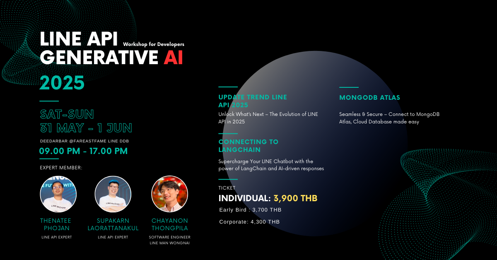

# ยินดีต้อนรับสู่ Workshop LINE Developer x Generative AI รุ่นที่ 5

<p align="center" width="100%">
     
</p>

## แนะนำตัว

ผู้สอน: เทพนที โพธิ์จันทร์ (โอ๋) LINE API Expert</br> 
ผู้ช่วยสอน : ศุภกานต์ เหล่รัตนกุล (พร็อมท์)</br>
ผู้ช่วยสอน : ชญานนท์ ทองพิลา (นัชชี่)</br>

พวกเรารู้สึกตื่นเต้นที่ได้มีโอกาสพบกับทุกคนในวันนี้ เพื่อร่วมสำรวจเทคโนโลยีและเครื่องมือใหม่ ๆ ที่ LINE มีให้ ไม่ว่าคุณจะมาที่นี่เพื่อพัฒนาทักษะการพัฒนาแอปพลิเคชัน, สำรวจ LINE APIs, หรือสร้างประสบการณ์ใหม่ ๆ สำหรับผู้ใช้งาน เราได้เตรียมกิจกรรมที่มีค่าและการเรียนรู้ที่มีประโยชน์ไว้ให้แล้ว

## สิ่งที่คุณจะได้พบ

ใน Workshop วันนี้เราจะครอบคลุมหัวข้อต่าง ๆ ดังนี้:

### LINE Messaging API
1. Introduction & Overview of LINE Official Account
2. Introduction to LINE Messaging API and System Architecture
3. Understanding Webhooks and Event Handling in LINE Platform
4. Creating Your First LINE Chatbot with Firebase Cloud Functions
5. Exploring Message Types and Action Objects in LINE Messaging API
6. Accessing User Profiles in Chats: Users, Groups, and Rooms
7. Implementing Security Best Practices for LINE Chatbot Development
8. Optimizing Performance with Caching Techniques
9. Scaling LINE Chatbots with Kafka Message Queues
10. Example Integration Gemini 

### Segment Management
1. Collect user data with LINE Webhook
2. Create Targeted Audience with LINE OA and LINE Messaging API
3. Sending Messages by Narrowcast

### Flex Message
1. Introduction & Overview
2. Using the Flex Message Simulator
3. Creating Flex Messages with ChatGPT
4. Tips and Tricks
5. Using Post back

### Rich Menu
1. Creating Rich Menus using Messaging API
2. Using Rich Menu Aliases
3. Implementing Rich Menu Switch Actions
4. Linking/Unlinking Rich Menus for Multiple Users
 
### Database : MongoDB
1. Introduction & Overview
2. Setting Up MongoDB Atlas
3. Integration with MongoDB Atlas
4. Designing Data Schema for LINE Chatbot
5. Use Case: Storing User Messages or Profile to MongoDB

> **ตัวอย่างโค้ด:**
> ```js
> // เชื่อมต่อ MongoDB และบันทึกโปรไฟล์ผู้ใช้
> const { MongoClient } = require('mongodb');
> const client = new MongoClient(process.env.MONGO_URI);
> await client.connect();
> const db = client.db('linebot');
> await db.collection('profiles').insertOne({ userId, displayName });
> ```

### LangChain Integration
1. Introduction & Overview
2. Using LangChain Library Typescript
3. Using Gemini API with LangChain for Embedding
4. Retrieval-Augmented Generation (RAG) with Atlas Vector Search

> **Use Case:**
> ใช้ LangChain เชื่อมต่อ Gemini API เพื่อสร้าง Embedding และค้นหาข้อมูลใน MongoDB Atlas Vector Search
> ```ts
> import { GeminiEmbeddings } from 'langchain/embeddings';
> const embeddings = new GeminiEmbeddings({ apiKey: 'YOUR_KEY' });
> const vector = await embeddings.embedQuery('สวัสดี LINE!');
> // นำ vector ไปค้นหาใน Atlas Vector Search
> ```

### LINE Frontend-Framework
1. Introduction & Overview
2. Initiating LIFF Applications
3. Authentication
4. Retrieving User Profiles
5. Sending Messages
6. Utilizing LINE URL Schemes
7. Create Privacy Policy Page for Certified provider
8. LIFF CLI vo.3.0

> **ตัวอย่างโค้ด:**
> ```js
> // ดึงโปรไฟล์ผู้ใช้ด้วย LIFF
> liff.init({ liffId: 'YOUR_LIFF_ID' }).then(() => {
>   if (liff.isLoggedIn()) {
>     liff.getProfile().then(profile => {
>       console.log(profile.displayName);
>     });
>   } else {
>     liff.login();
>   }
> });
> ```


### ประโยชน์ที่ทุกคนจะได้ใน Workshop นี้
- ผู้เรียนได้รู้จัก LINE API มากขึ้น 
- เข้าใจถึงการใช้งาน LINE API อย่างมีประสิทธิภาพ 
- สามารถประยุกต์ใช้กับ Product ที่ทำอยู่
- เข้าใจการพัฒนา LINE ด้วยภาษา JavaScript หรือ TypeScript
- Slide และ Source Code การสอน
- กลุ่มไว้ปรึกษา

### แหล่งข้อมูล

- [เอกสาร LINE API](https://developers.line.biz/en/docs/)


### เริ่มต้นกันเถอะ!

เราหวังว่าคุณจะสนุกกับ Workshop และได้รับประสบการณ์ที่มีประโยชน์และแรงบันดาลใจ ขอให้เราทำให้เวลาของเราในวันนี้เป็นสิ่งที่คุ้มค่าและสร้างสรรค์!
