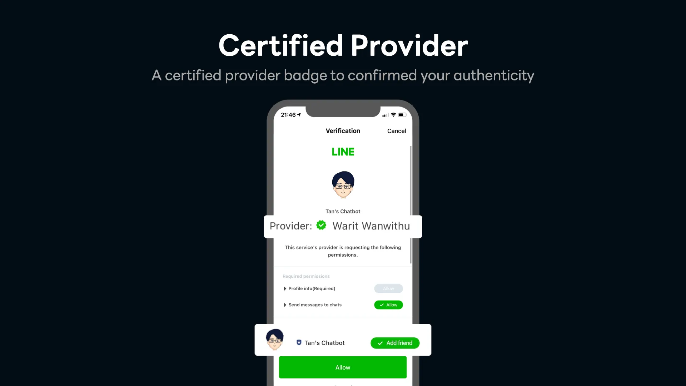

# Certified Provider

     

Certified Provider คือผู้ให้บริการ (Provider) ที่ได้รับการรับรองจาก LINE โดยจะได้รับสิทธิ์พิเศษในการเข้าถึง API และฟีเจอร์ใหม่ ๆ บน LINE Platform ซึ่ง ทุก Channel ที่อยู่ภายใต้ Certified Provider นั้นจะได้รับสิทธิ์ตามไปด้วย

---

## ประโยชน์ของการเป็น Certified Provider

| สิทธิพิเศษ | รายละเอียด |
|------------|------------|
| Certified Badge | แสดงในหน้า Consent/Home เพื่อสร้างความน่าเชื่อถือ |
| Auto Check Add Bot | ปุ่ม "Add friend" ถูกเลือกอัตโนมัติเมื่อผู้ใช้เข้าสู่ LIFF หรือ LINE Login |
| Access to Special API | ใช้ API พิเศษได้ เช่น `stay`, `profile+`, `mark-as-read` (ต้องขออนุมัติเป็นรายกรณี) |

---

## ตัวอย่าง API พิเศษ

- **Stay event**  
  ส่งสัญญาณทุก 10 วินาทีเมื่อผู้ใช้ยังอยู่ในรัศมี Beacon  
  (ใช้กับ DEVIO Beacon ได้)

- **Mark-as-read API**  
  ควบคุมเวลา Read ข้อความแบบ manual (ใช้ได้เฉพาะ Premium OA)

---

## วิธีสมัคร Certified Provider

1. **ชื่อ Provider ต้องเป็นบริษัท/องค์กร** ที่จดทะเบียนถูกต้อง
2. ใส่ **Privacy Policy URL** ในทุก Channel ที่อยู่ใต้ Provider
3. กรอกแบบฟอร์ม Certified Provider Application
4. แนบเอกสาร:
   - หนังสือรับรองบริษัท
   - สำเนาบัตรประชาชนผู้มีอำนาจ (หรือใบมอบอำนาจ + บัตร)
5. ส่งเอกสารทั้งหมดไปที่  
   **dl_api_th@linecorp.com**

---

## การขอใช้ Stay Event

### สำหรับ Certified Provider

- กรอก Stay event application form (Sheet: `For Certified Provider`)
- แนบ Proposal ระบุ:
  - วัตถุประสงค์การใช้งาน
  - สถานที่ติดตั้ง
  - ระยะเวลาใช้งาน
  - วิธีการเก็บข้อมูลผู้ใช้

### สำหรับ Developer / นักวิจัย

- กรอก Stay event application form (Sheet: `For Developers or Researchers`)
- แนบ Proposal เช่นเดียวกับด้านบน
- ใช้ Beacon ได้ไม่เกิน 5 ตัว
- ขอลองใช้งานฟรี (ระยะเวลา 3 เดือน/รอบ)

---

## หมายเหตุ

- เฉพาะ Official Account แบบ Verified หรือ Premium เท่านั้น ที่ขอใช้งาน Banner และ Stay Event ได้
- Certified Provider ไม่จำเป็นต้องเป็น Premium หรือ Verified OA (แยกสิทธิ์กัน)

---

## คำถามที่พบบ่อย (FAQ)

- **Q: ได้ Certified แล้ว OA เป็นบัญชีแบบไหน?**  
  → ได้ทั้งโล่เทา (Unverified), น้ำเงิน (Verified), หรือเขียว (Premium)

- **Q: Certified Provider กับ Verified OA ต่างกันอย่างไร?**  
  → Certified เป็นระดับ “Provider”  
     Verified เป็นระดับ “Channel” (บัญชี)

- **Q: ระยะเวลาพิจารณานานไหม?**  
  → ประมาณ 10 วันทำการ

---

## ผู้เขียนบทความต้นฉบับ

- Tan Warit  
  เผยแพร่ผ่าน [LINE Developers Thailand Medium](https://medium.com/linedevth)
