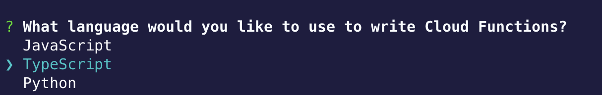
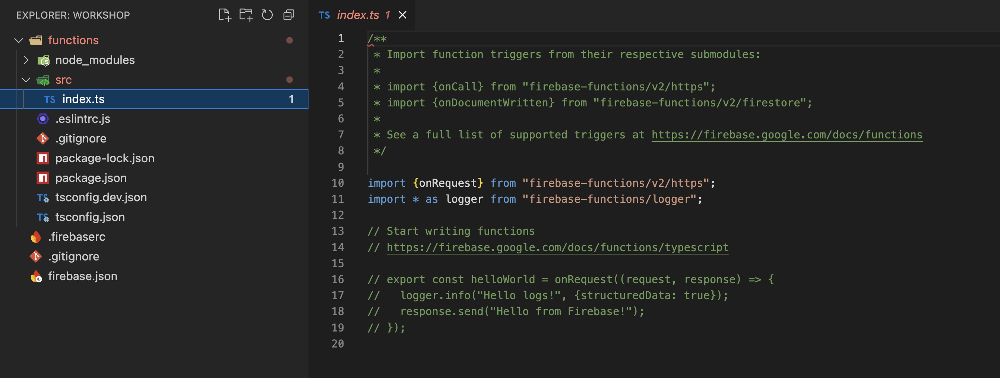
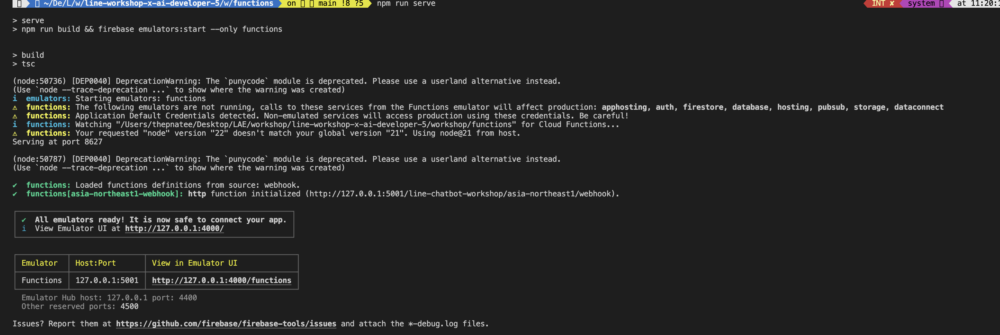

# การสร้าง LINE Chatbot ด้วย Firebase

## 🔥 Firebase คืออะไร?

Ref : https://medium.com/firebasethailand/cdda33bbd7dd

**Firebase** เป็นแพลตฟอร์มที่พัฒนาโดย Google ซึ่งให้บริการเครื่องมือและโครงสร้างพื้นฐานที่ช่วยให้นักพัฒนาสามารถสร้างและจัดการแอปพลิเคชันได้อย่างรวดเร็วและง่ายดาย Firebase มีบริการหลายประเภทที่ช่วยในด้านต่าง ๆ ของการพัฒนาแอปพลิเคชัน เช่น:

- **Firebase Cloud Functions**: ฟังก์ชันที่รันบนคลาวด์ซึ่งช่วยให้คุณสามารถเขียนและดำเนินการโค้ดที่ตอบสนองต่อเหตุการณ์ต่าง ๆ ได้
- **Firebase Firestore**: ฐานข้อมูล NoSQL ที่มีการจัดการแบบเอกสาร ซึ่งช่วยในการจัดเก็บและจัดการข้อมูล
- **Firebase Hosting**: บริการโฮสติ้งที่ช่วยให้คุณสามารถเผยแพร่เว็บไซต์และแอปพลิเคชันเว็บได้อย่างรวดเร็ว
- **Firebase Realtime Database**: ฐานข้อมูล NoSQL ที่ช่วยให้คุณสามารถจัดเก็บและซิงโครไนซ์ข้อมูลในเวลาเรียลไทม์
- **Firebase Authentication**: ระบบการจัดการการลงชื่อเข้าใช้ที่ช่วยให้ผู้ใช้สามารถเข้าสู่ระบบด้วยวิธีที่หลากหลาย


## 🛠️ ขั้นตอนที่ 1: เตรียมตวามพร้อม

1. **สร้างบัญชี LINE Developer**
   - เข้าสู่ [LINE Developer Console](https://developers.line.biz/console/) และลงชื่อเข้าใช้ด้วยบัญชี LINE ของคุณ
   - สร้าง Provider ใหม่และสร้าง Channel ใหม่สำหรับ LINE Messaging API

2. **ตั้งค่า Firebase Project**
   - ไปที่ [Firebase Console](https://console.firebase.google.com/)
   - คลิก "Add project" และทำตามขั้นตอนเพื่อสร้าง Firebase Project ใหม่
   - ตั้งค่า Firebase Cloud Functions และ Firebase Firestore ตามความต้องการของคุณ

## 📦 ขั้นตอนที่ 2: การตั้งค่า LINE Messaging API

1. **ลงทะเบียน LINE Bot**
   - ไปที่ [LINE Developers Console](https://developers.line.biz/console/)
   - เลือก Channel ที่สร้างขึ้นและบันทึก Channel ID, Channel Secret และ Access Token

2. **ตั้งค่า Webhook**
   - ใน LINE Developers Console, ไปที่การตั้งค่า Webhook ของ Channel และเปิดใช้งาน Webhook URL
   - Webhook URL นี้จะเป็นที่อยู่ที่ Firebase Cloud Functions ของคุณจะตอบกลับ

## 🧩 ขั้นตอนที่ 3: การสร้าง Firebase Cloud Function

1. **ติดตั้ง Firebase CLI**
   - เปิด Terminal หรือ Command Prompt และติดตั้ง Firebase CLI ด้วยคำสั่ง:
     ```bash
     npm install -g firebase-tools
     ```

2. **เข้าสู่ระบบ Firebase**
   - เข้าสู่ระบบ Firebase ด้วยคำสั่ง:
     ```bash
     firebase login
     ```

3. **สร้างโปรเจกต์ Firebase**
   - สร้างโปรเจกต์ Firebase ใหม่ในไดเรกทอรีที่คุณต้องการ:
     ```bash
     firebase init
     ```
4. **เลือก ตามรูปด้านล่าง**
<p align="center" width="100%">
     
</p>   
<p align="center" width="100%">
     
</p>   

```bash
เลือก Project ที่ได้สร้างไว้บน Firebase Console
```
<p align="center" width="100%">
     
</p>   

```
? What language would you like to use to write Cloud Functions?
  JavaScript
❯ TypeScript
  Python
```


<p align="center" width="100%">
     
</p> 

```
? Do you want to use ESLint to catch probable bugs and enforce style?
 ❯ No
```
```
? Do you want to install dependencies with npm now? 
 ❯ Yes
```

```
=== Emulators Setup
? Which Firebase emulators do you want to set up? Press Space to select emulators, then Enter to confirm your choices. (Press <space> to select, <a> to toggle all, <i> to invert
selection, and <enter> to proceed)
 ◯ Cloud Tasks Emulator
 ◯ App Hosting Emulator
 ◯ Authentication Emulator
❯◉ Functions Emulator
 ◯ Firestore Emulator
 ◯ Database Emulator
 ◯ Hosting Emulator
```

<p align="center" width="100%">
     
</p

<p align="center" width="100%">
     
</p>  

```
Open Code to edit the functions/index.ts file.
```

<p align="center" width="100%">
     
</p>  

```
functions/
│
├── src/                   ← โค้ด TypeScript จะอยู่ที่นี่
│   └── index.ts           ← จุดเริ่มต้นของ Cloud Functions
│
├── lib/                   ← โฟลเดอร์ที่เก็บไฟล์ .js ที่ถูก compile จาก TypeScript
│
├── package.json           ← รายการ dependencies ของ functions
├── tsconfig.json          ← การตั้งค่า TypeScript
```

5. **ติดตั้ง dependencies**
   - ไปที่ไดเรกทอรี `functions` และติดตั้ง dependencies ที่จำเป็นสำหรับการทำงานของ Cloud Functions:
     ```bash
     cd functions
     npm install
     ```

6. **เขียน Cloud Function**
   - แก้ไขไฟล์ `index.js` ในไดเรกทอรี `functions/src` และเพิ่มโค้ดดังนี้:
     ```javascript
      /*
      setGlobalOptions: ใช้ตั้งค่าเริ่มต้นของ Cloud Functions เช่น region, memory ฯลฯ
      onRequest: ใช้สร้าง HTTP-triggered function (รับ HTTP request ได้)
      Request, Response: เป็น type ของ Express ที่ใช้กำหนดรูปแบบ request และ response

      */

      import { setGlobalOptions } from "firebase-functions/v2";
      import { onRequest } from "firebase-functions/v2/https";
      import { Request, Response } from "express";

      /*
      region: กำหนดให้ function ทำงานอยู่ที่ Tokyo (asia-northeast1)
      memory: จัดสรร RAM 1GiB
      concurrency: รองรับคำขอพร้อมกันได้สูงสุด 40 รายการ
      */

      setGlobalOptions({
         region: "asia-northeast1",
         memory: "1GiB",
         concurrency: 40
      });


      export const webhook = onRequest({ invoker: "public" }, async (request: Request, response: Response): Promise<void> => {
         /*
         ถ้าไม่ใช่ POST จะตอบกลับด้วยสถานะ 405 Method Not Allowed
         ข้อนี้ใช้ป้องกันไม่ให้ method อื่น (เช่น GET) มาเรียก function นี้ได้
         */
         if (request.method !== "POST") {
            response.status(405).send("Method Not Allowed");
         }


         /*
            ดึงข้อมูล events จาก body ของ request
         */
         const events = request.body.events;

         if (!Array.isArray(events)) {
            console.error("Invalid payload: 'events' is not an array", request.body);
            response.status(400).send("Invalid payload");
            return
         }

         for (const event of events) {
            console.log(event);
         }

         response.end();
         return
      });
     ```

## ⚙️ ขั้นตอนที่ 4: การใช้ Firebase Emulator

**เริ่มต้น Firebase Emulator**
   - ใช้คำสั่งนี้เพื่อเริ่มต้น Firebase Emulator Suite และทดสอบ Cloud Functions ของคุณในสภาพแวดล้อมที่ท้องถิ่น:
     ```bash
     npm run serve
     ```

   - คุณจะเห็น URL ที่ Local Emulator สำหรับ Cloud Functions ซึ่งคุณสามารถใช้ในการทดสอบ
   <p align="center" width="100%">
     
   </p> 

   ```
   npm run serve                                                                  

   > serve
   > npm run build && firebase emulators:start --only functions


   > build
   > tsc

   (node:50736) [DEP0040] DeprecationWarning: The `punycode` module is deprecated. Please use a userland alternative instead.
   (Use `node --trace-deprecation ...` to show where the warning was created)
   i  emulators: Starting emulators: functions
   ⚠  functions: The following emulators are not running, calls to these services from the Functions emulator will affect production: apphosting, auth, firestore, database, hosting, pubsub, storage, dataconnect
   ⚠  functions: Application Default Credentials detected. Non-emulated services will access production using these credentials. Be careful!
   i  functions: Watching "/Users/thepnatee/Desktop/LAE/workshop/line-workshop-x-ai-developer-5/workshop/functions" for Cloud Functions...
   ⚠  functions: Your requested "node" version "22" doesn't match your global version "21". Using node@21 from host.
   Serving at port 8627

   (node:50787) [DEP0040] DeprecationWarning: The `punycode` module is deprecated. Please use a userland alternative instead.
   (Use `node --trace-deprecation ...` to show where the warning was created)

   ✔  functions: Loaded functions definitions from source: webhook.
   ✔  functions[asia-northeast1-webhook]: http function initialized (http://127.0.0.1:5001/line-chatbot-workshop/asia-northeast1/webhook).

   ┌─────────────────────────────────────────────────────────────┐
   │ ✔  All emulators ready! It is now safe to connect your app. │
   │ i  View Emulator UI at http://127.0.0.1:4000/               │
   └─────────────────────────────────────────────────────────────┘

   ┌───────────┬────────────────┬─────────────────────────────────┐
   │ Emulator  │ Host:Port      │ View in Emulator UI             │
   ├───────────┼────────────────┼─────────────────────────────────┤
   │ Functions │ 127.0.0.1:5001 │ http://127.0.0.1:4000/functions │
   └───────────┴────────────────┴─────────────────────────────────┘
   Emulator Hub host: 127.0.0.1 port: 4400
   Other reserved ports: 4500

   Issues? Report them at https://github.com/firebase/firebase-tools/issues and attach the *-debug.log files.
   ```
