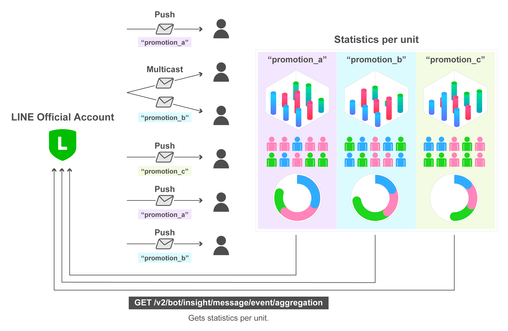

# Get Statistics of Sent Messages

สามารถดึงข้อมูลสถิติเกี่ยวกับการปฏิสัมพันธ์ของผู้ใช้กับข้อความแบบ push และ multicast ที่คุณส่งไปยังผู้ใช้หลายรายได้ โดยสามารถกำหนดหน่วยรวมข้อมูล (aggregation unit) เพื่อแยกสถิติออกเป็นกลุ่ม ๆ ตามที่คุณต้องการ


<p align="center" width="100%">
     
</p>


### 📊 What Are Message Statistics

หลังจากกำหนด unit name ขณะส่งข้อความแล้ว คุณสามารถดึงสถิติของข้อความในแต่ละหน่วยได้ โดยจะมีข้อมูลดังนี้:

- ✅ จำนวนผู้ใช้ที่เปิดอ่านข้อความ  
- 🔗 จำนวนผู้ใช้ที่เปิด URL ใด ๆ ในข้อความ  
- ▶️ จำนวนผู้ใช้ที่เริ่มเล่นวิดีโอหรือเสียงในข้อความ  

การใช้สถิติเหล่านี้ช่วยให้คุณสามารถวิเคราะห์พฤติกรรมของผู้ใช้ และวัดผลประสิทธิภาพของการสื่อสารได้

### ตัวอย่างข้อมูลสถิติที่ได้:

| จำนวนผู้รับ | จำนวนการเปิดข้อความ | อัตราการเปิด | จำนวนการคลิกลิงก์ | อัตราการคลิกลิงก์ |
|--------------|----------------------|----------------|---------------------|----------------------|
| 500          | 433                  | 87%            | 323                 | 65%                  |

---

### 📝 หมายเหตุเกี่ยวกับข้อมูลสถิติแบบรวม (Notes on Aggregated Statistics)

ข้อมูลสถิติที่ได้อาจมีความคลาดเคลื่อนเล็กน้อย เพื่อปกป้องความเป็นส่วนตัวของผู้ใช้ ระบบจะ **แสดงค่าเป็น null (ไม่มีข้อมูล)** ในกรณีดังต่อไปนี้:

1. ค่าสถิติรวม (aggregated statistics) น้อยกว่า 20  
2. ถึงแม้ว่าค่าสถิติรวมจะมากกว่าหรือเท่ากับ 20 แต่ **จำนวนผู้ใช้จริงที่มีส่วนร่วมกับเหตุการณ์นั้น ๆ มีน้อยกว่า 20 คน**

### ตัวอย่าง:

หากมีข้อมูลดังนี้:
- จำนวนครั้งที่มีการเริ่มเล่นวิดีโอ = 30  
- จำนวนผู้ใช้ที่เริ่มเล่นวิดีโอ = 15

ผลลัพธ์ที่ได้จะถูกแสดงเป็น:
```json
{
  "videoPlayCount": null,
  "uniqueUsersPlayedVideo": null
}
```
---

### การจัดการจำนวน Unit Name สูงสุดต่อเดือน (Maximum Number of Unit Name Types)

### ขีดจำกัดของ Unit Name ต่อเดือน

ภายในเดือนปัจจุบัน (ตั้งแต่วันที่ 1 ถึงวันสุดท้ายของเดือน) คุณสามารถส่งข้อความพร้อมกำหนดชื่อหน่วย (unit name) ได้สูงสุด **1,000 แบบ** ต่อเดือน

### ตัวอย่าง

- หากคุณส่งข้อความในเดือนมีนาคม โดยใช้ชื่อหน่วยตั้งแต่ `promotion_0001` ถึง `promotion_1000` (รวม 1,000 แบบ)  
  ➤ ในเดือนถัดไป (เมษายน) คุณสามารถ:
  - ใช้ชื่อเดิม (`promotion_0001` ถึง `promotion_1000`) ได้อีกครั้ง  
  - หรือใช้ชื่อใหม่ (`promotion_1001` ถึง `promotion_2000`) ก็ได้

### ข้อควรระวัง

หากคุณส่งข้อความโดยใช้ชื่อหน่วยเกินขีดจำกัด เช่น `promotion_0001` ถึง `promotion_1500` (รวม 1,500 แบบ):

- เฉพาะชื่อ `promotion_0001` ถึง `promotion_1000` เท่านั้นที่จะถูกบันทึกเป็น unit name
- ตั้งแต่ `promotion_1001` เป็นต้นไป **จะไม่ถูกจัดเก็บเป็น unit name**  
  ➤ ข้อความจะถูกส่ง แต่ **ไม่สามารถดึงสถิติแบบแยกตาม unit name ได้**

## ตรวจสอบจำนวน Unit Name ที่ใช้งาน

คุณสามารถตรวจสอบจำนวนชื่อหน่วยที่กำหนดไว้ในเดือนปัจจุบันได้โดยใช้ API:
- `Get the number of unit name types assigned during this month`

---
* แม้จะมีข้อจำกัดในการ "กำหนดชื่อหน่วยได้สูงสุด 1,000 แบบต่อเดือน"  
แต่หากคุณดึงข้อมูลสถิติย้อนหลังสำหรับช่วงเวลาที่มีข้อความส่งออกไป คุณจะยังสามารถดูข้อมูลของ **unit name ทั้งหมดที่อยู่ในช่วงเวลานั้น** ได้ (หากเคยถูกกำหนดในช่วงเวลาก่อนหน้า)

---

### Example

1. ส่งข้อความโดยกำหนด Unit Name
```bash
curl -v -X POST https://api.line.me/v2/bot/message/multicast \
-H 'Content-Type: application/json' \
-H 'Authorization: Bearer {channel access token}' \
-d '{
    "to": ["U4af4980629...","U0c229f96c4...",...], // 150 user IDs
    "messages":[
        {
            "type": "text",
            "text": "🆕 Our new product is available now!\nhttps://example.com/new-item/"
        }
    ],
    "customAggregationUnits": [
        "new-item-message-yyyymmdd"
    ]
}'
```

2. ดึงและรวมสถิติ
รอสักระยะ (เช่น 1–2 วัน) หลังจากส่งข้อความ แล้วใช้ API เพื่อดึงสถิติตาม unit name ที่กำหนดไว้

```bash
curl -v -X GET https://api.line.me/v2/bot/insight/message/event/aggregation \
-H 'Authorization: Bearer {channel access token}' \
--data-urlencode 'customAggregationUnit=new-item-message-yyyymmdd' \
--data-urlencode 'from=20210301' \
--data-urlencode 'to=20210331' \
-G
```

ตัวอย่างผลลัพธ์ที่ได้:

```json
{
  "overview": {
    "uniqueImpression": 111,
    "uniqueClick": 74,
    "uniqueMediaPlayed": null,
    "uniqueMediaPlayed100Percent": null
  },
  "messages": [
    {
      "seq": 1,
      "impression": 111,
      "uniqueImpression": 111,
      "mediaPlayed": null,
      "mediaPlayed25Percent": null,
      "mediaPlayed50Percent": null,
      "mediaPlayed75Percent": null,
      "mediaPlayed100Percent": null,
      "uniqueMediaPlayed": null,
      "uniqueMediaPlayed25Percent": null,
      "uniqueMediaPlayed50Percent": null,
      "uniqueMediaPlayed75Percent": null,
      "uniqueMediaPlayed100Percent": null
    }
  ],
  "clicks": [
    {
      "seq": 1,
      "url": "https://example.com/new-item/",
      "click": 74,
      "uniqueClick": 74,
      "uniqueClickOfRequest": 74
    }
  ]
}


```