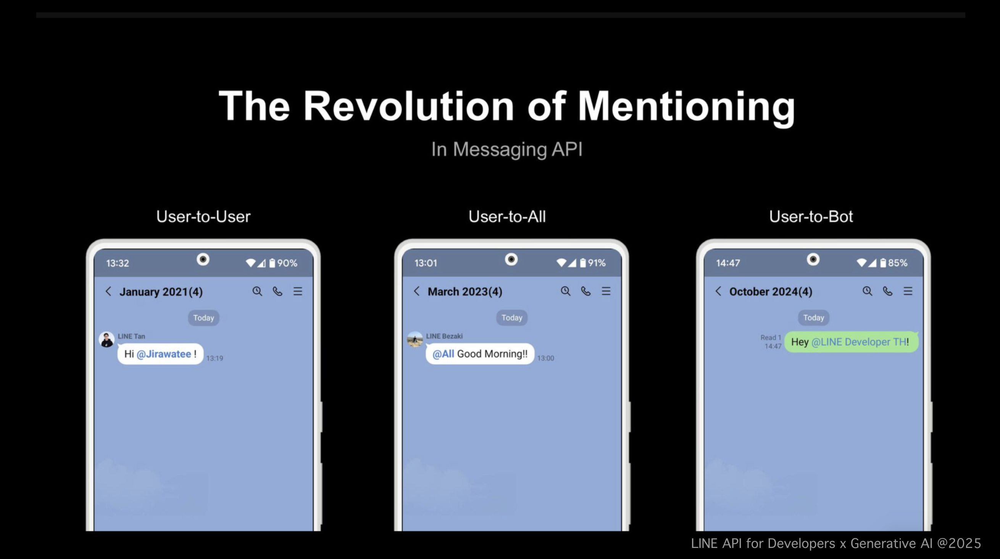

# Mention

Messaging API เราได้เปิดตัว ข้อความแบบใหม่ (text message v2) ซึ่งเป็นวัตถุข้อความรูปแบบใหม่
โดยการใช้ข้อความแบบ v2 นี้ คุณสามารถระบุการกล่าวถึงผู้ใช้ (mentions) ได้โดยตรง
นอกจากนี้ เมื่อเทียบกับข้อความแบบเดิมที่เคยให้บริการมาก่อนหน้านี้ การระบุ อีโมจิของ LINE ก็สามารถทำได้ง่ายยิ่งขึ้น


<p align="center">
     
</p>

ข้อความเวอร์ชันใหม่ (v2) ถูกออกแบบมาให้สามารถแทนที่ข้อความที่อยู่ภายใน {} ด้วย mentions หรือ emojis ได้โดยอัตโนมัติ
โดยต้องกำหนดรายละเอียดของสิ่งที่จะแทนที่ไว้ในคุณสมบัติ substitution

```json
{
  "type": "textV2",
  "text": "Welcome, {user1}! {laugh}\n{everyone} There is a newcomer!",
  "substitution": {
    "user1": {
      "type": "mention",
      "mentionee": {
        "type": "user",
        "userId": "U49585cd0d5..."
      }
    },
    "laugh": {
      "type": "emoji",
      "productId": "5a8555cfe6256cc92ea23c2a",
      "emojiId": "002"
    },
    "everyone": {
      "type": "mention",
      "mentionee": {
        "type": "all"
      }
    }
  }
}
```

Important Notes on Mentions

- Mentions are supported **only in reply and push messages**
- Target must be a **group chat** or **multi-person chat**
- Your **LINE Official Account must be a member** of the group or chat
- All mentioned users must also be **members of the same chat**