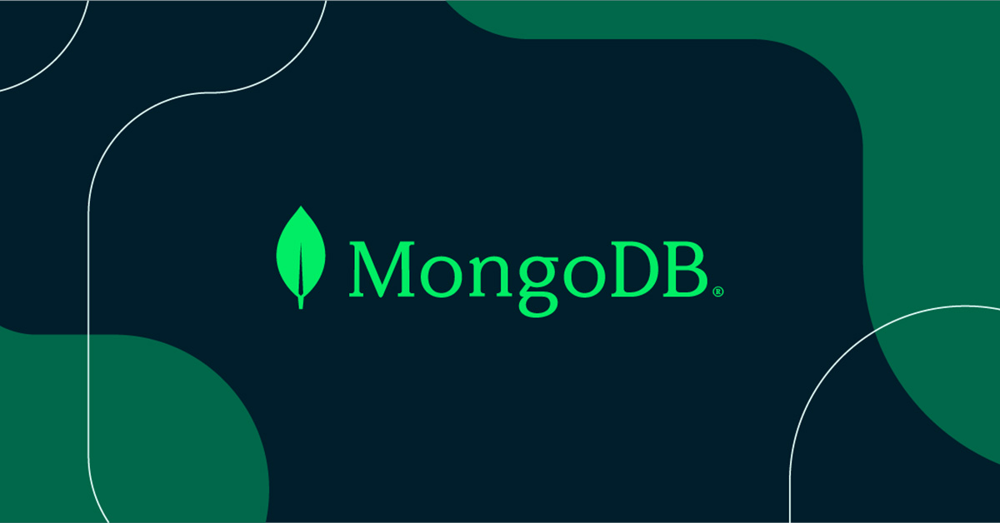
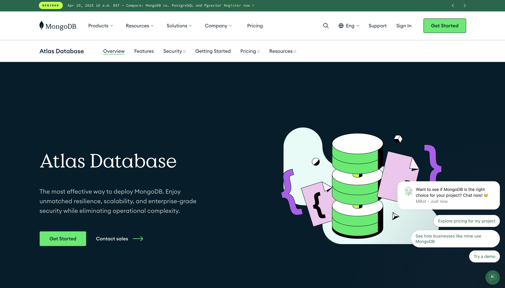
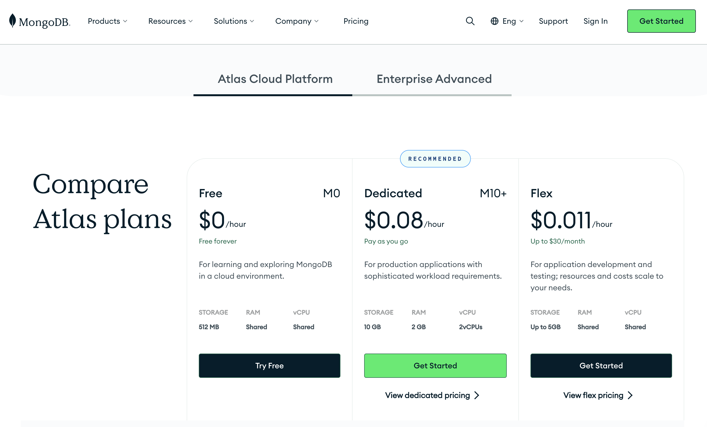

# MongoDB Overview


MongoDB คือฐานข้อมูลประเภท NoSQL ที่มีความยืดหยุ่นสูง เก็บข้อมูลในรูปแบบ Document และเป็นที่นิยมอย่างแพร่หลายในการพัฒนาเว็บแอปสมัยใหม่ โดยเฉพาะงานที่ต้องการความเร็วในการพัฒนาและการขยายระบบในอนาคต

<p align="center" >
     
</p>


**MongoDB** เป็นฐานข้อมูลแบบ **NoSQL (Not Only SQL)** ซึ่งใช้รูปแบบ **Document-Oriented** ในการจัดเก็บข้อมูล  
ข้อมูลจะถูกเก็บในรูปแบบ **BSON (Binary JSON)** ซึ่งสามารถเก็บข้อมูลที่ซับซ้อนได้ เช่น array, nested object
- สมัครใช้งาน: [MongoDB Atlas](https://www.mongodb.com/atlas)
- เอกสารเพิ่มเติม: [MongoDB Atlas Documentation](https://www.mongodb.com/docs/atlas/)


ตัวอย่าง Document:
```json
{
  "name": "John Doe",
  "email": "john@example.com",
  "skills": ["JavaScript", "Node.js", "MongoDB"],
  "isActive": true
}
```

---

##  ข้อดีของ MongoDB

|ข้อดี | รายละเอียด |
|---|---|
| ยืดหยุ่นสูง | ไม่จำเป็นต้องมี Schema แบบตายตัว | 
| เร็วและรองรับ Big Data | เหมาะกับแอปพลิเคชันที่มีข้อมูลจำนวนมาก|
| รองรับ Horizontal Scaling | สามารถกระจายข้อมูลไปหลาย Server ได้ |
| มี Aggregation Framework | ใช้สำหรับการประมวลผลข้อมูลในรูปแบบ pipeline |
| มี Full-text Search | ค้นหาข้อความแบบเร็วได้ในตัว | 
| รองรับ Security และ Indexing เต็มรูปแบบ | เช่น authentication, role-based access control|


## โครงสร้างของ MongoDB
MongoDB มีโครงสร้างการเก็บข้อมูลแบบลำดับชั้น:
```
MongoDB
 └── Database
     └── Collection
         └── Document
```

- Database: ฐานข้อมูลหนึ่งชุด เช่น my_app
- Collection: เหมือน "ตาราง" ใน SQL เช่น users, orders
- Document: เหมือน "แถว" แต่มีความยืดหยุ่นมากกว่า เช่น { name: "Alice" }

---


# MongoDB Atlas

<p align="center" >
     
</p>


MongoDB Atlas คือบริการ MongoDB-as-a-Service ที่ให้คุณใช้งานฐานข้อมูล MongoDB ได้แบบ "Managed Cloud Database" โดยไม่ต้องติดตั้งเองบนเซิร์ฟเวอร์!

## ข้อดีของ MongoDB Atlas
|หัวข้อ | รายละเอียด
|---|---|
|เป็นบริการของ | บริษัท MongoDB Inc. (เจ้าของ MongoDB ตัวจริง)
|รันบน Cloud | รองรับ AWS, Google Cloud (GCP), และ Microsoft Azure
|ติดตั้งไม่ยุ่งยาก | มี UI สำหรับจัดการฐานข้อมูลผ่านเว็บ และเชื่อมต่อได้ผ่าน URI
|ปลอดภัย | รองรับ Security, IP Whitelisting, Role-based Access, Data Encryption
|มี Auto Scaling | ขยายขนาด Cluster อัตโนมัติเมื่อมีการใช้งานเพิ่มขึ้น
|มี Backup/Restore | สำรองข้อมูลอัตโนมัติ หรือกู้ข้อมูลย้อนหลังได้
|Monitoring | มีเครื่องมือดู Performance, Query Analyzer, Index Stats, Slow Queries

---

### MongoDB Atlas Pricing Summary (อัปเดตล่าสุด)

<p align="center" >
     
</p>


#### แผนการใช้งาน MongoDB Atlas

MongoDB Atlas มีแผนการใช้งานหลัก ๆ ดังนี้:

#### 1. **Free Tier**
- **ราคา**: ฟรีตลอดไป
- **คุณสมบัติ**:
  - RAM: 512MB
  - Storage: 5GB
  - เหมาะสำหรับการทดลองหรือแอปขนาดเล็ก

#### 2. **Flex Tier**
- **ราคา**: เริ่มต้นที่ $8/เดือน สูงสุดไม่เกิน $30/เดือน
- **คุณสมบัติ**:
  - รองรับการใช้งานสูงสุด 500 ops/sec
  - เหมาะสำหรับแอปที่มีการใช้งานไม่แน่นอนหรือมีการเปลี่ยนแปลงบ่อย
  - คิดค่าบริการตามการใช้งานจริง (pay-as-you-go)

#### 3. **Dedicated Tier**
- **ราคา**: เริ่มต้นที่ $57/เดือน (ขึ้นอยู่กับขนาดและภูมิภาค)
- **คุณสมบัติ**:
  - มีหลายขนาดให้เลือก (M10 ถึง M300)
  - รองรับการใช้งานระดับ Production
  - มีฟีเจอร์ขั้นสูง เช่น Auto-scaling, Backup, และ Monitoring

---

#### ราคานี้อิงจาก Cluster แบบ Dedicated Tier บน MongoDB Atlas (pay-as-you-go)

| Tier   | Storage | RAM     | vCPUs   | Base Price (USD/hr) |
|--------|---------|---------|---------|----------------------|
| **M10**  | 10 GB   | 1.7 GB  | 0.5     | $0.08/hr             |
| **M20**  | 20 GB   | 3.75 GB | 1       | $0.19/hr             |
| **M30**  | 40 GB   | 8 GB    | 2       | $0.44/hr             |
| **M40**  | 80 GB   | 16 GB   | 4       | $0.86/hr             |
| **M50**  | 160 GB  | 32 GB   | 8       | $1.66/hr             |
| **M60**  | 320 GB  | 64 GB   | 16      | $3.29/hr             |
| **M80**  | 750 GB  | 128 GB  | 32      | $6.13/hr             |
| **M140** | 1000 GB | 192 GB  | 48      | $9.54/hr             |
| **M200** | 1500 GB | 256 GB  | 64      | $12.96/hr            |
| **M250** | 1750 GB | 320 GB  | 80      | $16.30/hr            |
| **M300** | 2000 GB | 360 GB  | 96      | $19.39/hr            |
| **M400** | 3000 GB | 512 GB  | 64      | $21.28/hr            |
| **M600** | 4096 GB | 640 GB  | 80      | $27.17/hr            |

#### หมายเหตุ

- ราคานี้เป็น **ราคาต่อชั่วโมง** (`Hourly Billing`)
- รวมเฉพาะค่า Cluster Base Price เท่านั้น (ยังไม่รวมค่า backup, data transfer, etc.)
- ราคาจะแตกต่างกันเล็กน้อยตาม Region และ Cloud Provider (AWS, GCP, Azure)
- หากรัน 24/7 ต่อเดือน (ประมาณ 730 ชั่วโมง):
  - เช่น **M10** ≈ $0.08 × 730 = ~$58.40 ต่อเดือน

---