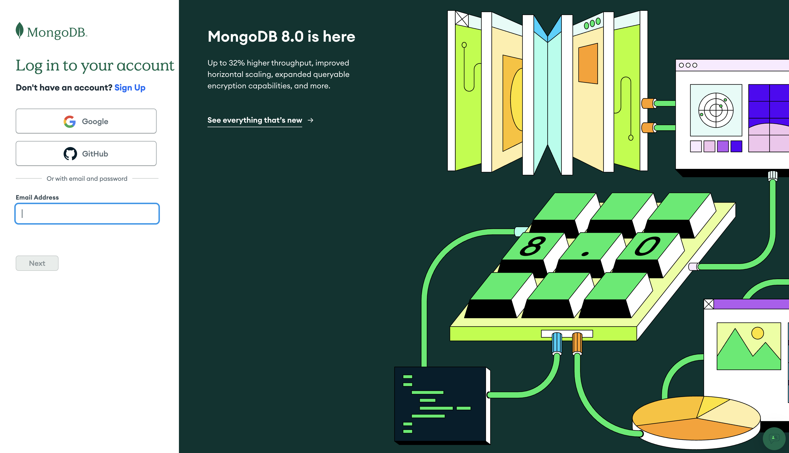
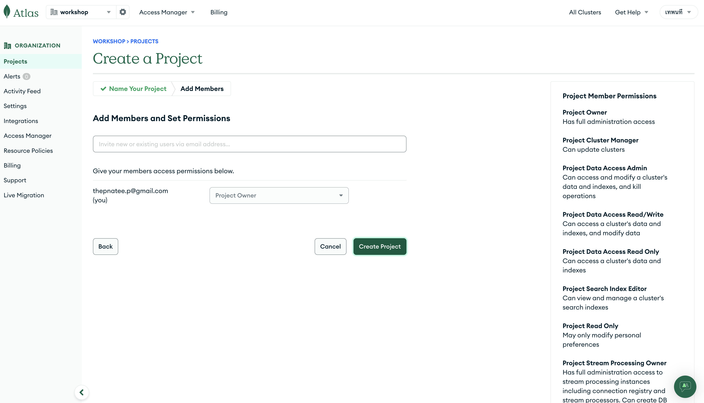
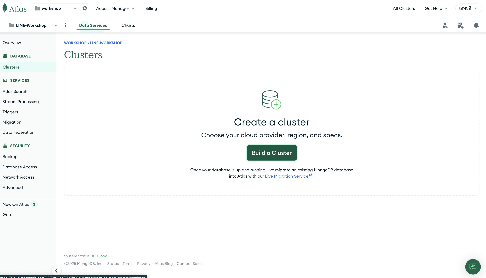
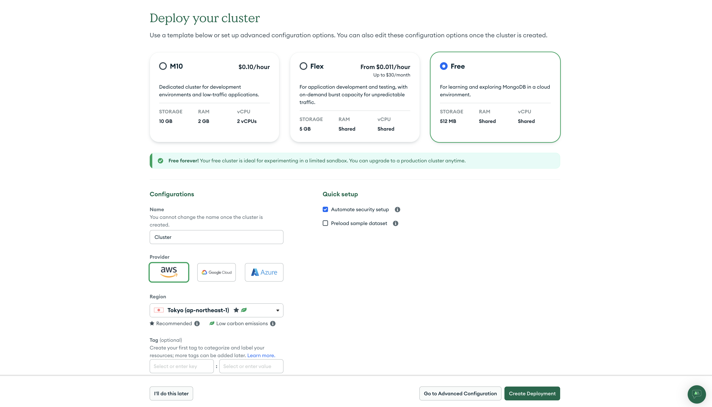
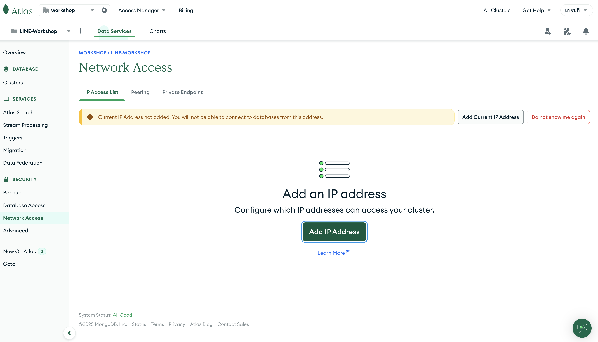
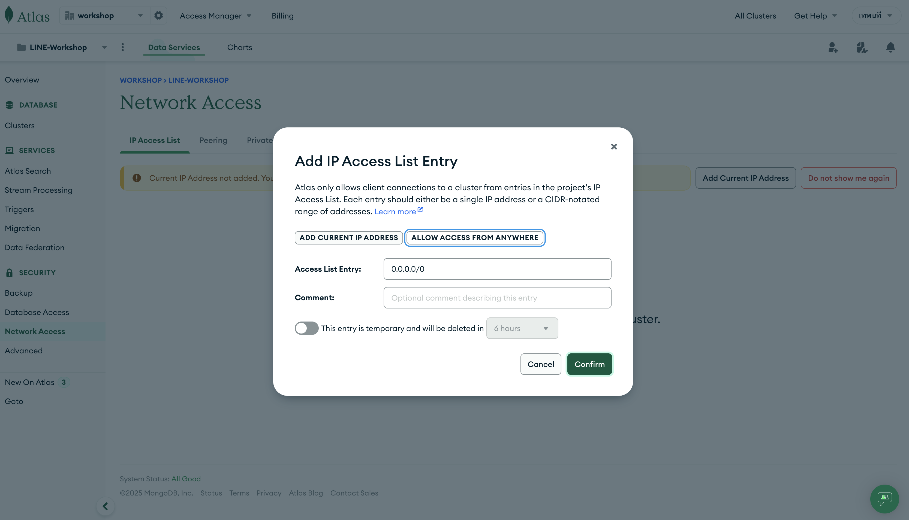
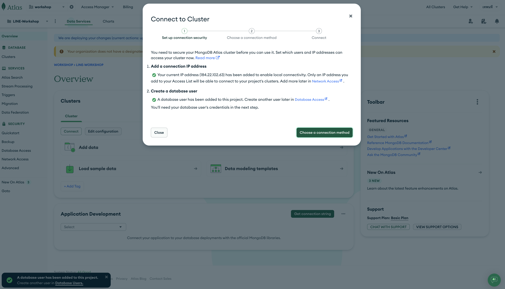
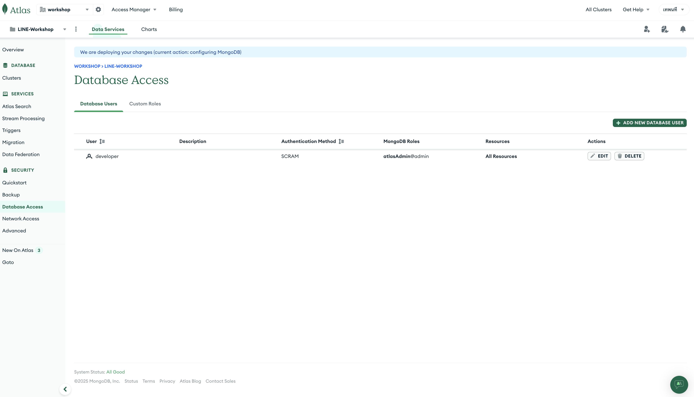
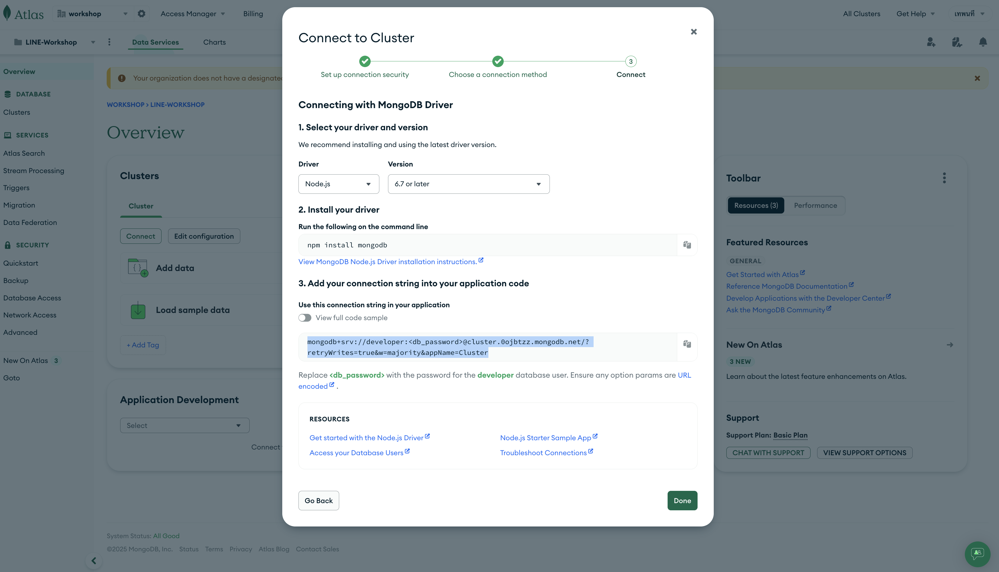

# MongoDB Atlas Setup: Step-by-Step Guide

---

## Step 1: สมัคร / เข้าสู่ระบบ MongoDB Atlas


<p align="center" >
     
</p>


1. ไปที่เว็บไซต์: [https://www.mongodb.com/cloud/atlas](https://www.mongodb.com/cloud/atlas)
2. คลิกปุ่ม **"Start Free"**
3. เลือก "Login with Google" หรือสมัครด้วย Email
4. หลังจาก login แล้ว จะเข้าสู่หน้า **Atlas Dashboard**

---

## Step 2: สร้าง Project ใหม่


1. คลิกที่ **“New Project”**
2. ตั้งชื่อโปรเจกต์ (เช่น `LINE-Workshop`)
3. คลิกปุ่ม **"Next"**

<p align="center" >
     
</p>
<p align="center" >
     
</p>

---

## Step 3: สร้าง Cluster

1. คลิก **"Build a Cluster"**
<p align="center" >
     
</p>
  
2. เลือกแผน (Free Tier หรือ Paid):
   - แนะนำเลือก **Free Shared Cluster (M0)** ถ้าทดลองใช้งาน
3. เลือก Cloud Provider:
   - `AWS` / GCP / Azure (เลือกที่คุณสะดวก)
4. เลือก Region  `Tokyo`
5. ตั้งชื่อ Cluster `Cluster`
6. กดปุ่ม **"Create Cluster"**

<p align="center" >
     
</p>

> รอประมาณ 1-3 นาทีให้ระบบสร้าง Cluster เสร็จ

---

## Step 4: ตั้งค่า Network Access

> เพื่ออนุญาตให้เชื่อมต่อจากเครื่องของคุณ
   
   <p align="center" >
     
  </p>

1. ไปที่ **“Network Access”** ในเมนูด้านซ้าย
2. กด **“Add IP Address”**
3. กดปุ่ม **“Allow Access from Anywhere”** (0.0.0.0/0)
   - หรือระบุ IP Address ของคุณแบบเจาะจง
   <p align="center" >
     
  </p>

4. กด **“Confirm”**
   <p align="center" >
     
  </p>

---

## Step 5: สร้าง Database User

> เพื่อเชื่อมต่อ MongoDB ด้วยชื่อผู้ใช้/รหัสผ่าน

   <p align="center" >
     
  </p>

1. ไปที่ **“Database Access”**
2. กด **“Add New Database User”**
3. ตั้งค่า:
   - Username: เช่น `admin`
   - Password: สร้างรหัสผ่านแล้วบันทึกไว้
   - กด “Built-In Roles” → เลือก “Atlas Admin” หรือ “Read and Write Any Database”
4. กด **“Add User”**

---

## Step 6: เชื่อมต่อกับ Cluster

   <p align="center" >
     
  </p>


1. กลับไปที่ **"Clusters"**
2. กดปุ่ม **"Connect"**
3. เลือก **“Connect your application”**
4. Copy MongoDB URI เช่น:
```bash
MONGODB_URI='mongodb+srv://developer:<password>@cluster.0ojbtzz.mongodb.net/?retryWrites=true&w=majority&appName=Cluster'

```
อย่าลืมใส่ <password> ที่คุณตั้งไว้ตอนสร้าง user

```bash
npm install mongodb
```