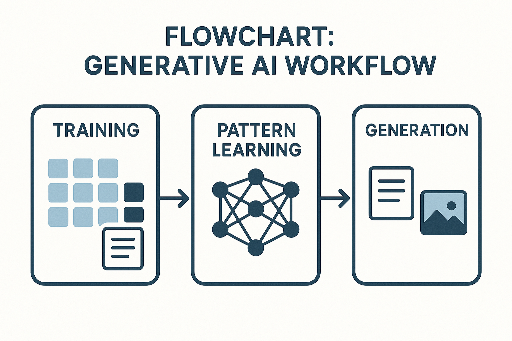

# Generative AI

Generative AI คือเทคโนโลยีปัญญาประดิษฐ์ที่สามารถ **"สร้างข้อมูลใหม่"** ขึ้นมาได้โดยเลียนแบบรูปแบบของข้อมูลที่เรียนรู้มา เช่น ข้อความ รูปภาพ เพลง โค้ด หรือแม้แต่วิดีโอ โดยไม่ใช่แค่การดึงข้อมูลเดิมมาตอบเท่านั้น

---

## Generative AI ทำงานอย่างไร?

Generative AI ทำงานโดยใช้โมเดล Deep Learning เช่น **Transformers**, **GANs**, หรือ **Diffusion Models** เพื่อเรียนรู้รูปแบบของข้อมูล เช่น โครงสร้างประโยค ลายเส้นของภาพ หรือเมโลดี้ของเพลง แล้วนำมาสร้างสิ่งใหม่

### กระบวนการทั่วไป:
1. **Training (การฝึก)**  
   โมเดลถูกฝึกด้วยข้อมูลจำนวนมาก เช่น ข้อความหลายล้านประโยค หรือรูปภาพนับล้านภาพ

2. **Pattern Learning (การเรียนรู้รูปแบบ)**  
   AI เรียนรู้ว่า "ข้อมูลที่ดี" มีโครงสร้างแบบไหน เช่น คำไหนมักตามหลังคำไหน, รูปหน้าคนต้องมีตา-จมูก-ปาก

3. **Generation (การสร้าง)**  
   เมื่อได้รับคำสั่งหรือ prompt เช่น “วาดแมวบนดวงจันทร์” หรือ “สรุปข่าววันนี้” โมเดลจะสร้างสิ่งใหม่ที่สอดคล้องกับสิ่งที่ฝึกมา

  

<small align="center">ตัวอย่าง Flowchart: กระบวนการทำงานของ Generative AI (Training → Pattern Learning → Generation)</small>

---

## ประเภทของ Generative AI และตัวอย่าง

### 1. **Text Generation (ข้อความ)**

ใช้ในการสร้าง บทความ สนทนา อีเมล สรุปข้อมูล แปลภาษา และอื่น ๆ

- **ChatGPT / Claude / Gemini** – สนทนา, ตอบคำถาม
- **Copy.ai / Jasper** – เขียนโฆษณา บทความ SEO
- **Notion AI** – ช่วยร่างสรุปประชุม เอกสารงาน

*ตัวอย่างการใช้งาน*:  
- สร้างบทความบล็อกจากคำสั่ง "เขียนบทความเรื่อง AI ในการศึกษา"  
- ตอบอีเมลอัตโนมัติ  
- แปลภาษาทันทีหลายภาษา

---

### 2. **Image Generation (รูปภาพ)**

สร้างรูปภาพใหม่จากคำสั่ง เช่น ภาพวาด ภาพประกอบ หรือภาพถ่ายเสมือนจริง

- 🔹 **DALL·E / Midjourney / Stable Diffusion**
- 🔹 **Adobe Firefly** – ปรับแต่งภาพจากข้อความ
- 🔹 **Runway ML** – สร้างภาพ + วิดีโอจากข้อความ

*ตัวอย่างการใช้งาน*:  
- วาด “มังกรสีน้ำเงินกำลังบินเหนือทะเลในยามค่ำคืน”  
- ออกแบบโลโก้ / mood board เบื้องต้น  
- สร้างฉากในเกมหรือหนัง

---

### 3. **Code Generation (โค้ด)**

ช่วยเขียนและแนะนำโค้ด พร้อมอธิบายโค้ดและแก้บั๊ก

- 🔹 **GitHub Copilot** – ผู้ช่วยเขียนโค้ด
- 🔹 **CodeWhisperer (Amazon)** – แนะนำโค้ดเฉพาะงาน
- 🔹 **ChatGPT** – เขียนฟังก์ชันอัตโนมัติ + แก้ปัญหา

*ตัวอย่างการใช้งาน*:  
- เขียนฟังก์ชัน `mergeSort()` ใน Python  
- อธิบาย SQL query ที่ซับซ้อน  
- แปลง pseudocode ให้เป็น JavaScript

---

### 4. **Audio & Music Generation (เสียงและดนตรี)**

สร้างเสียงพูด เสียงดนตรี เพลง หรือโทนเสียงจำลอง

- **ElevenLabs / Descript** – สร้างเสียงพูดสมจริง
- **Jukebox (OpenAI)** – สร้างเพลงในสไตล์ต่าง ๆ
- **Voicemod** – เปลี่ยนเสียงแบบเรียลไทม์

*ตัวอย่างการใช้งาน*:  
- สร้างเสียงพากย์สื่อการสอน  
- แต่งเพลงใหม่ในสไตล์ Beatles  
- แปลงข้อความเป็นเสียงเพื่อใช้ในคลิป TikTok

---

### 5. **Video Generation (วิดีโอ)**

สร้างวิดีโอจากข้อความ หรือขยายภาพเคลื่อนไหว

- **Runway / Pika / Sora (OpenAI)** – สร้างวิดีโอจาก prompt
- **Synthesia** – พรีเซนเตอร์ AI
- **Kaiber** – สร้างมิวสิกวิดีโอจากภาพ/เสียง

*ตัวอย่างการใช้งาน*:  
- สร้างวิดีโอ “AI อธิบายเรื่องภาวะโลกร้อน” โดยไม่มีคนจริง  
- ตัดต่อวิดีโออัตโนมัติจาก script  
- ทำคลิปโฆษณาสั้นในไม่กี่นาที

---

## ข้อดีของ Generative AI

- สร้างเนื้อหาได้อย่าง **รวดเร็วและคุ้มค่า**
- ช่วยเพิ่ม **ไอเดีย ความคิดสร้างสรรค์** สำหรับมนุษย์
- ประหยัดเวลาและต้นทุนในงานที่ทำซ้ำ ๆ
- ใช้เป็นเครื่องมือช่วยในทุกอุตสาหกรรม เช่น การศึกษา การตลาด วิศวกรรม

---

## ข้อจำกัดและความเสี่ยง

| ความเสี่ยง | รายละเอียด |
|------------|-------------|
| Hallucination | AI อาจ "แต่งข้อมูล" ที่ไม่ถูกต้อง |
| ลิขสิทธิ์ | สื่อที่สร้างอาจละเมิดต้นฉบับโดยไม่ตั้งใจ |
| อคติ (Bias) | หากข้อมูลฝึกมีอคติ AI ก็จะสะท้อนสิ่งนั้น |
| โปร่งใสต่ำ | ยากจะตรวจสอบแหล่งที่มาของข้อมูลที่ใช้สร้าง |

---

## แนวโน้มของ Generative AI

- การรวมเข้ากับระบบงานในองค์กร (AI-as-a-Service)
- Generative AI แบบเฉพาะด้าน เช่น กฎหมาย การแพทย์
- เทคโนโลยี Multimodal AI → AI ที่รับรู้ทั้งข้อความ ภาพ เสียง
- การควบคุมด้วยกฎระเบียบ เช่น AI Governance / Explainable AI

---

## ข้อควรระวังและ Best Practice ในการใช้งาน Generative AI

- ควรตรวจสอบและกลั่นกรองผลลัพธ์ที่ได้จาก AI ก่อนนำไปใช้งานจริง โดยเฉพาะข้อมูลสำคัญหรือเนื้อหาสำหรับเผยแพร่
- หลีกเลี่ยงการป้อนข้อมูลส่วนตัวหรือข้อมูลสำคัญลงในระบบ AI สาธารณะ
- ระวังเรื่องลิขสิทธิ์และการนำเนื้อหาที่ AI สร้างไปใช้ต่อ ควรตรวจสอบแหล่งที่มาและข้อกำหนดการใช้งาน
- ใช้ prompt ที่ชัดเจนและมีรายละเอียด เพื่อให้ได้ผลลัพธ์ที่ตรงความต้องการมากขึ้น
- หากใช้ในงานที่มีผลกระทบสูง เช่น การแพทย์ กฎหมาย หรือการเงิน ควรมีผู้เชี่ยวชาญตรวจสอบซ้ำเสมอ

---

## สรุป

> Generative AI คือเครื่องมือแห่งอนาคตที่เปลี่ยนผู้ใช้งานทุกคนให้กลายเป็น “ผู้สร้าง” โดยไม่จำเป็นต้องมีทักษะเชิงเทคนิคขั้นสูง

ไม่ว่าจะเป็นนักเรียน นักพัฒนา นักออกแบบ นักเขียน หรือเจ้าของธุรกิจ — Generative AI สามารถกลายเป็นผู้ช่วยอัจฉริยะที่ช่วยคุณสร้างเนื้อหาที่รวดเร็ว ทันสมัย และมีคุณภาพได้อย่างน่าทึ่ง

---

