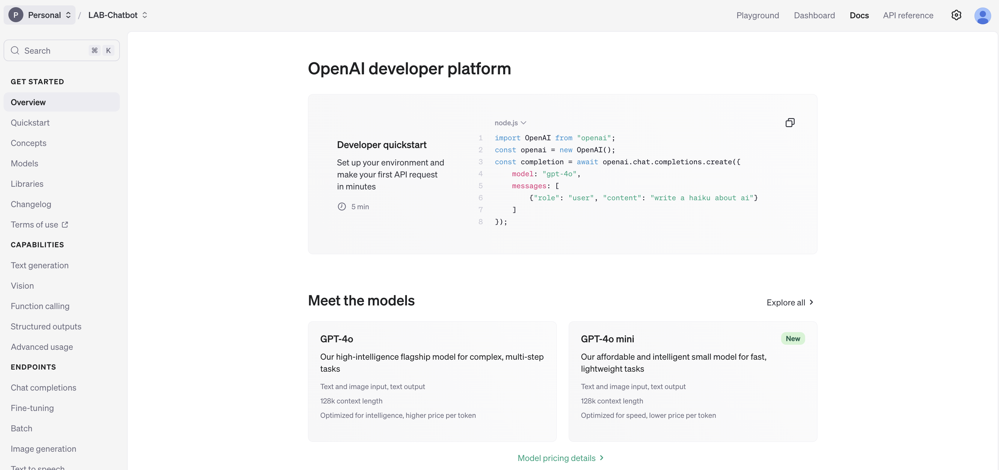
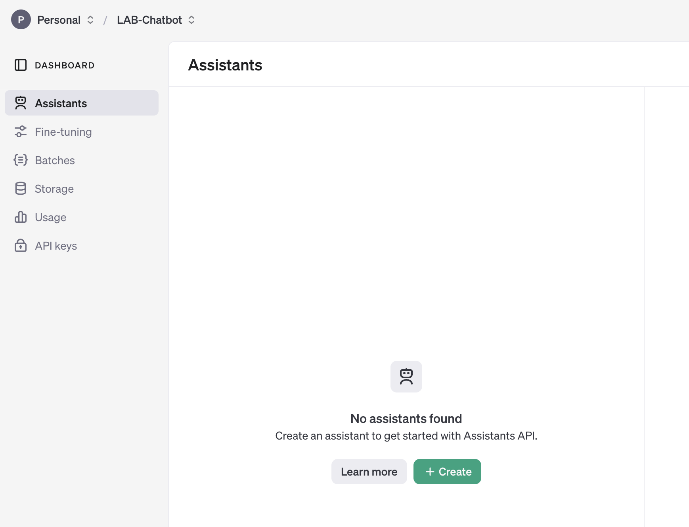
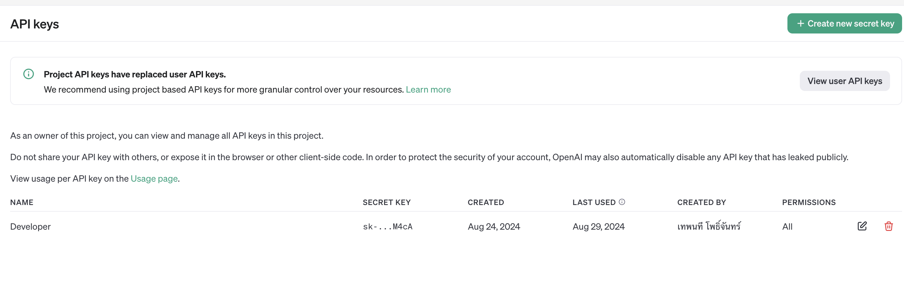

## ขั้นตอนการใช้งาน ChatGPT - API ร่วมกับ LINE  Chatbot
https://platform.openai.com/docs/overview


1. สร้างบัญชีและเข้าถึง OpenAI API
<p align="center" width="100%">
     
</p>
2. คลิกเมนู Dashboard มุมขวาบน
<p align="center" width="100%">
     
</p>


3. คลิกมนู API Keys ด้านซ้าย และ กดปุ่ม "+Create new secret key"

<p align="center" width="100%">
     
</p>

4. กรอก "LINE Developer" และ กดปุ่ม Create secret key 
    - Permission เลือกเป็น ALL
<p align="center" width="100%">
     
</p>

5. ท่านจะได้ API Key ให้นำไปเพิ่มใน ไฟล์ .env
```
#ChatGPT
OPEN_AI_API_KEY='xxxx'
```