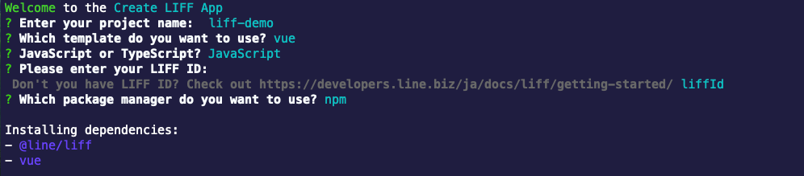
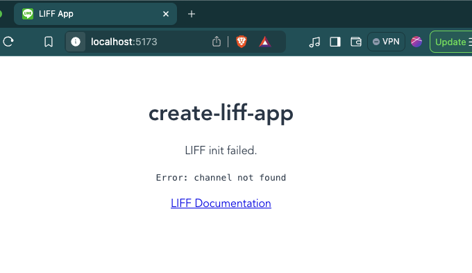
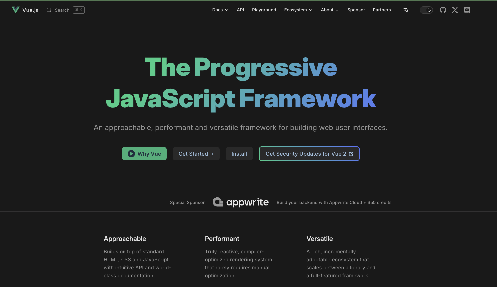

# เริ่มต้นสร้าง LINE Front-end Framework (LIFF) ด้วย Vue.js



### ขั้นตอนที่ 1: สร้างเว็บไซต์พัฒนาร่วมกับ LIFF

1. สร้างโปรเจกต์ใหม่ ใช้คำสั่งด้านล่างนี้เพื่อสร้าง LIFF

```bash
npx @line/create-liff-app
```

ในการสาธิตนี้ เราจะตั้งชื่อโปรเจกต์ว่า `liff-demo` ใช้ Vue.js (JavaScript) เป็นเฟรมเวิร์ก และ npm เป็นตัวจัดการแพ็กเกจ สามารถตอบคำถามตามข้อความด้านล่างนี้

```bash
# ตั้งชื่อ Project
Enter your project name: liff-demo

# Framwork Vue.js(3)
Which template do you want to use? vue

# เลือกภาษาในการพัฒนา
JavaScript or TypeScript? JavaScript

# กรอก LIFF ID ที่ได้จากแชนเนล LINE Login -> LIFF
Please enter your LIFF ID: xxx-xxx

# เลือก Package
Which package manager do you want to use? npm
```

### ขั้นตอนที่ 2: ติดตั้งและเรียกใช้งาน

1. เข้าไปยังโฟลเดอร์ของโปรเจกต์ที่สร้าง

```bash
cd liff-demo
```

2. ติดตั้ง Dependencies ที่จำเป็น

```bash
npm install
```

3. เปิดเซิร์ฟเวอร์สำหรับพัฒนาเว็บไซต์

```bash
npm run dev
```

เซิร์ฟเวอร์เว็บไซต์ของคุณจะถูกเปิดใช้งานและสามารถเข้าถึงได้ผ่าน URL ที่แสดงอยู่บน Terminal ในที่นี้คือ `http://localhost:5173` (หาก Port ไม่ซ้ำกับที่ใช้งานอยู่บนเครื่อง หรือแก้ไข Config ใด ๆ)

```bash
  VITE v6.3.4  ready in 139 ms

  ➜  Local:   http://localhost:5173/
  ➜  Network: use --host to expose
  ➜  press h + enter to show help
```



- **หากขึ้น LIFF init Failed.** หมายถึง เราใส่ LIFF ID ไม่ถูกต้อง
- **หากขึ้น LIFF init succeeded.** หมายถึง เราใส่ LIFF ID ได้ถูกต้อง

### ขั้นตอนที่ 3: เปิดให้ภายนอกสามารถเข้าถึงเว็บไซต์ระหว่างการพัฒนา

ในการพัฒนา LIFF App หาต้องการเปิดบนสมาร์ตโฟนเพื่อทำการตรวจสอบ แน่นอนว่าไม่สามารถเข้าถึง `http://localhost:xxxx` ได้โดยตรง จะต้องเป็น `https` เท่านั้น เราจะต้องขุดอุโมงเพื่อให้ภายนอกสามารถเข้าถึง localhost ของเราได้ โดยมีหลายวิธีทั้ง Ngrok, Cloudflare Tunnel หรือบริการอื่น ๆ อีกหลายตัว

ใน Visual Studio Code ก็มีบริการขุดอุโมงหรือ Port Forwarding อยู่เช่นกัน สามารถทำได้ตามนี้

1. เปิด Panel **Ports** ขึ้นมา
2. กด **Forward a Port**
3. เข้าสู่ระบบด้วย GitHub หากยังไม่ได้เข้าสู่ระบบและอนุญาตบริการ
4. ใส่เลขพอร์ต `5173` หรือพอร์ตที่รันเว็บไซต์อยู่
5. คลิกขวา ไปที่ **Port Visibility** เลือก **Public**
6. คัดลอก URL ในช่อง **Forwarded Address** เพื่อนำไปใช้งานต่อไป

### ขั้นตอนที่ 4: ตั้งค่า LIFF App เพื่อทดสอบบนสมาร์ตโฟน

1. ไปที่ [LINE Developers Console](https://developers.line.biz/console) ในแชนเนล LINE Login และ LIFF App ที่สร้างไว้
2. นำ URL ที่คัดลอกมาจาก**ขั้นตอนที่ 3** มาแก้ไขในช่อง **Endpoint URL** กด **Update**
3. คัดลอก **LIFF URL** ไปใส่ในแชท LINE เพื่อทดสอบ

# Vue.js

<p align="center" width="100%">
    
</p>

## "The Progressive JavaScript Framework"

Vue.js อ่านว่า วิว ออกเสียงแบบ View ในภาษาอังกฤษ จุดเริ่มต้นของ Vue เลยคือมันทำหน้าที่เป็น View ใน MVC (Model View Controller) นั่นแหละ เป็น JavaScript Framework ที่พัฒนาโดย Evan You เอาไว้สำหรับพัฒนาพวก UI (User Interface) และในบาง Framework เช่น Laravel ก็ใช้ Vue เป็น Template สำหรับส่วน UI (Frontend) ซึ่ง Vue.js ไม่ได้มี back ใหญ่ๆแบบ Angular (Google) หรือ React (Facebook) แต่ก็มี community ชาวจีนที่ค่อนข้างใหญ่ รวมถึง Alibaba ด้วย

ในหน้าเว็บของ Vue ให้คำนิยามว่า "The Progressive JavaScript Framework"

แค่คุณเข้าใจ 3 สิ่งนี้ คุณก็เป็น Vue Developer ได้

- HTML & CSS
- JavaScript
- Modern JavaScript (JavaScript ES6)
