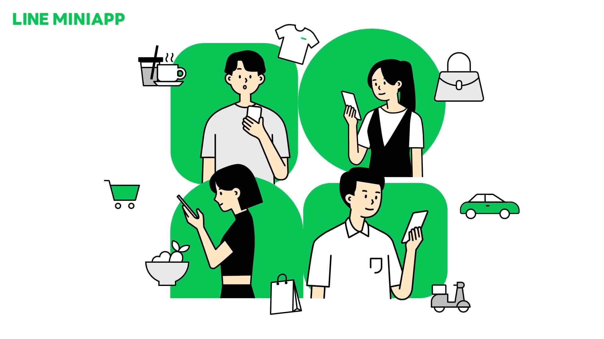
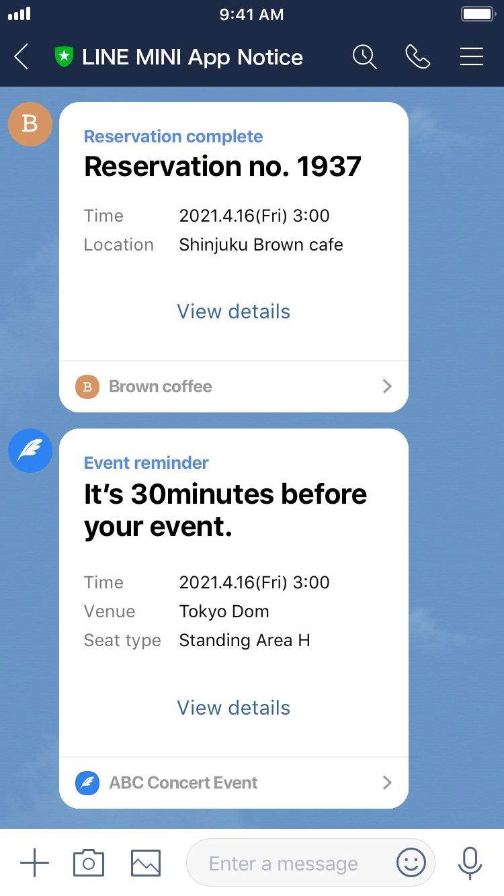
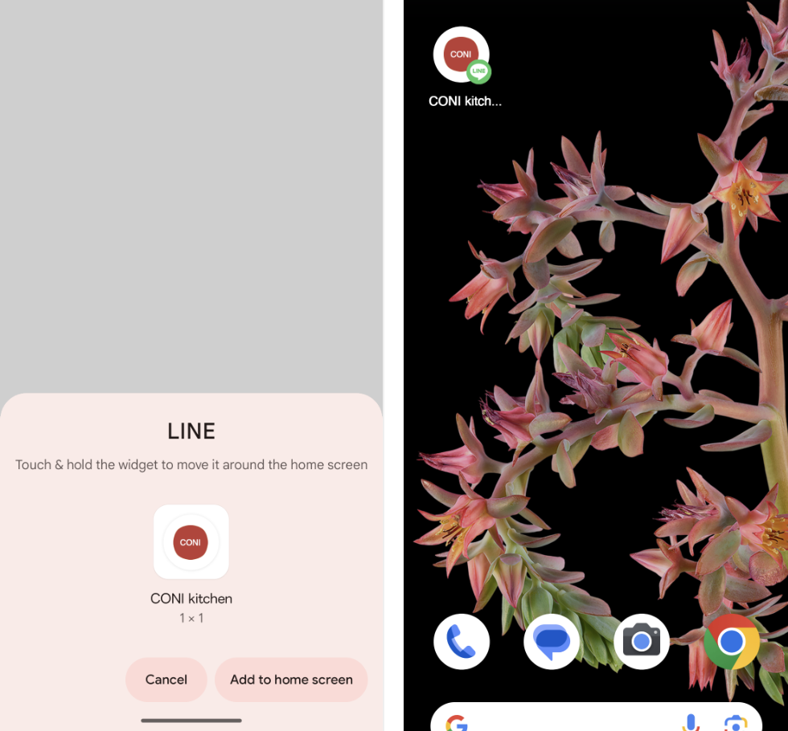
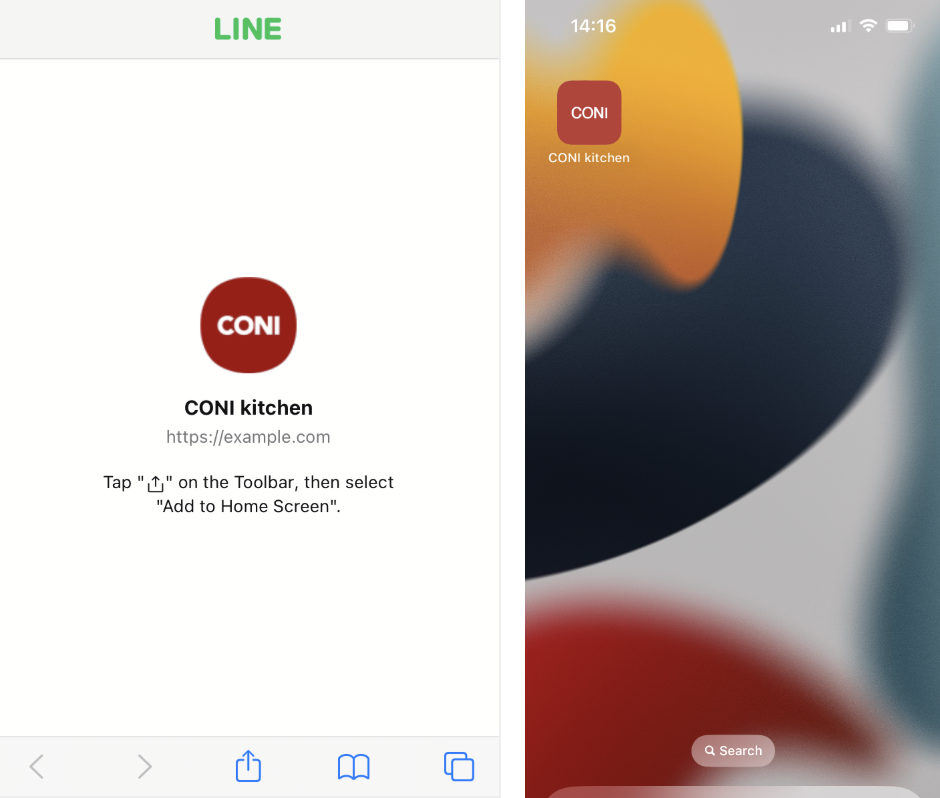

# LINE MINI App

**LINE MINI App** เป็นอีกหนึ่งบริการที่หลาย ๆ คนอาจจะได้ยินชื่อมาสักระยะหนึ่งแล้ว แต่ไม่ค่อยเป็นที่นิยม เพราะก่อนหน้านี้การพัฒนา LINE MINI App จำเป็นที่จะต้องยื่นเอกสารต่าง ๆ นานามากมาย เพื่อการพัฒนาและการใช้งานจริง ๆ

แต่ในปัจจุบัน LINE ได้ประกาศเตรียมตัวรีแบรนด์ LIFF (LINE Front-end Framework) จากในแชนเนล LINE Login ให้มาใช้ที่ LINE MINI App แทน โดยตอนนี้ในระดับ Global ทาง LINE ได้ประกาศเปิดให้นักพัฒนาทั่วไปสามารถสร้าง LINE MINI App ได้เองแล้ว โดยที่ไม่ต้องยื่นเอกสาร แต่สำหรับประเทศไทย จะสามารถทำได้เช่นกันในอนาคตอันใกล้

## LINE MINI App ยังคงต้องส่งเอกสารเพื่อพัฒนาและเผยแพร่หรือไม่

ในการพัฒนาสามารถสร้างและพัฒนาได้เลยจากใน [LINE Developers Console](https://developers.line.biz/console) โดย LINE MINI App ที่จะเผยแพร่บน Production จะถูกแยกเป็น 2 ประเภท คือ Verified MINI App จะต้องยื่นเอกสารกับ LINE เพื่อรับการตรวจสอบและเผยแพร่ขึ้น Production และ Unverified MINI App ไม่ต้องยื่นเอกสารให้ LINE ตรวจสอบ สามารถนำขึ้น Production และใช้งานได้ทันที

## Verified MINI App vs. Unverified MINI App

| ฟีเจอร์                            | Verified MINI App | Unverified MINI App |
| ---------------------------------- | :---------------: | :-----------------: |
| ความสามารถ LIFF                    |        ✅         |         ✅          |
| ใช้งานบน Browser (ต.ค.​ 2025)      |        ✅         |         ✅          |
| ระบบชำระเงิน (อนาคต)               |        ✅         |         ✅          |
| แนะนำ LINE OA เพื่อเพิ่มเพื่อน     |        ✅         |         ✅          |
| เปลี่ยนแปลง URL (Custom Path)      |        ✅         |                     |
| ข้อความแจ้งเตือน (Service Message) |        ✅         |                     |
| เพิ่มทางลัดที่หน้าจอโฮม            |        ✅         |                     |
| ข้ามการขออนุญาต                    |        ✅         |                     |
| ซ่อน URL เข้าถึง พร้อมไอคอนยืนยัน  |        ✅         |                     |

## ฟีเจอร์ LINE MINI App ที่น่าสนใจ

- ข้อความแจ้งเตือน (Service Message) 

  

- เปลี่ยนแปลง URL (Custom Path) 

  

- เพิ่มทางลัดที่หน้าจอโฮม (Add to Home Screen) 

  

  

## LINE MINI App vs. LIFF

ปัจจุบันอยู่ในระยะถ่ายผ่านจาก LIFF ในแชนเนล LINE Login สู่ LINE MINI App การรีแบรนด์ยังไม่เรียบร้อยดี LIFF และ LINE MINI App ยังมีฟีเจอร์ที่ต่างกันอยู่เล็กน้อย การเลือกใช้งานต้องพิจารณาจากลักษณะการใช้งานอีกที

| ฟีเจอร์                                       | LIFF |         Unverified MINI App         |          Verified MINI App          |
| --------------------------------------------- | :--: | :---------------------------------: | :---------------------------------: |
| สร้างได้หลาย LIFF App ในแชนเนลเดียวกัน        |  ✅  | แยก 3 สภาพแวดล้อม ไม่สามารถเพิ่มได้ | แยก 3 สภาพแวดล้อม ไม่สามารถเพิ่มได้ |
| เปลี่ยนขนาดของ LIFF App (Full, Tall, Compact) |  ✅  |                                     |                                     |
| ดึงข้อมูลโปรไฟล์ (`liff.getProfile()`)        |  ✅  |                 ✅                  |                 ✅                  |
| ส่งข้อความ (`liff.sendMessages()`)            |  ✅  |                 ✅                  |                 ✅                  |
| แชร์ข้อความ (`liff.shareTargetPicker()`)      |  ✅  |                 ✅                  |                 ✅                  |
| ใช้งานบน Browser                              |  ✅  |           ✅ (ต.ค.​ 2025)           |           ✅ (ต.ค.​ 2025)           |
| ข้อความแจ้งเตือน (Service Message)            |      |                                     |                 ✅                  |
| เปลี่ยนแปลง URL (Custom Path)                 |      |                                     |                 ✅                  |
| ข้อความแจ้งเตือน (Service Message)            |      |                                     |                 ✅                  |
| เพิ่มทางลัดที่หน้าจอโฮม                       |      |                                     |                 ✅                  |
| ข้ามการขออนุญาต                               |      |                                     |                 ✅                  |
| ซ่อน URL เข้าถึง พร้อมไอคอนยืนยัน             |      |                                     |                 ✅                  |

จะสังเกตได้ว่า LIFF กับ Unverified MINI App แทบจะไม่มีความแตกต่างกันเลย หากไม่ต้องการยืนยันเพื่อใช้ฟีเจอร์ที่ใช้ได้เฉพาะบน Verified MINI App เท่านั้น เพียงแต่ LINE MINI App จะไม่สามารถแบ่งสภาพแวดล้อมได้หลายสภาพแวดล้อม ถ้าเทียบกับ LIFF ในแชนเนล LINE Login และการเลือกขนาดที่ LINE MINI App ยังไม่สามารถเลือกได้

---

หากต้องการทดสอบ LINE MINI App และ LIFF เพื่อดูความแตกต่างสามารถทดลองได้ที่ LIFF Playground และ LINE MINI App Playground

- [LIFF Playground](https://liff.line.me/1656508316-k7jNojXm)
- [LINE MINI App Playground](https://miniapp.line.me/2006593963-DPoAqdzG)
