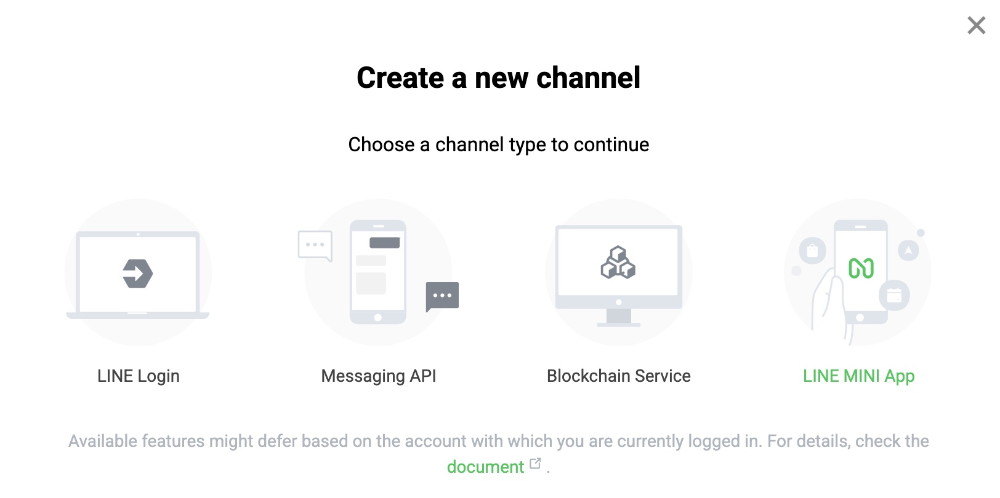
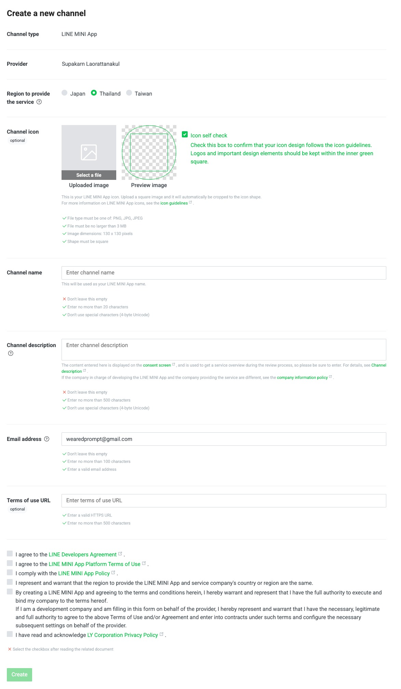
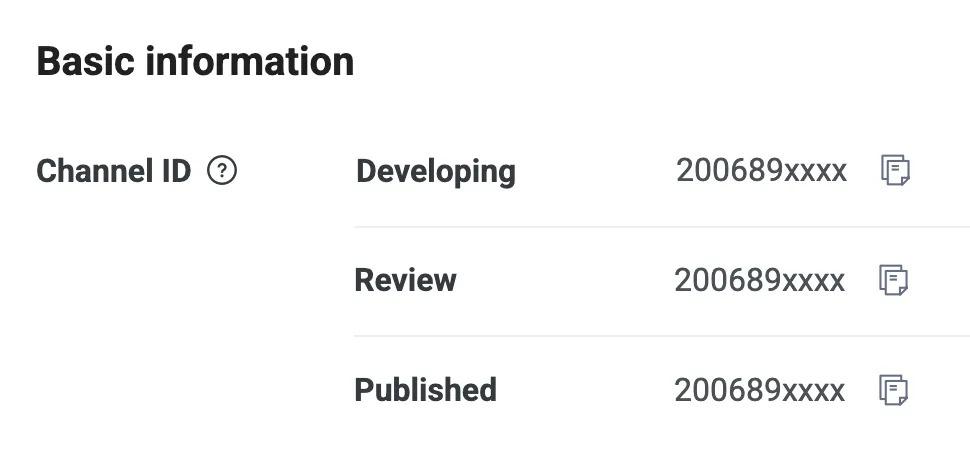
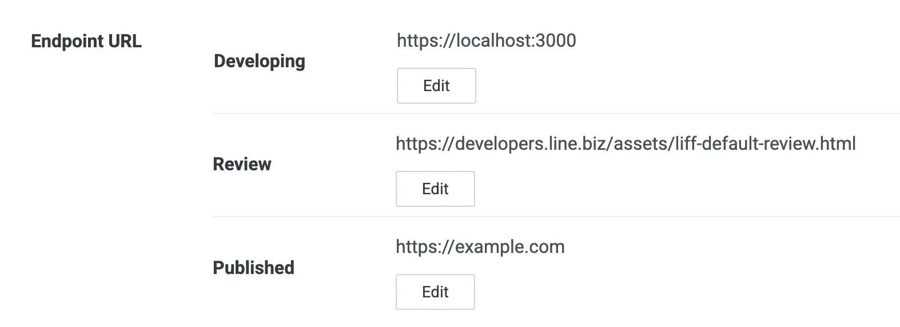
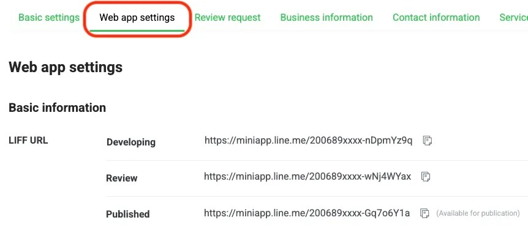

# เริ่มต้นพัฒนา LINE MINI App

## สร้างแชนเนล LINE MINI App

1. ใน [LINE Developers Console](https://developers.line.biz/console) เลือก Provider ที่ต้องการสร้าง กด `Create a new channel` จากนั้นเลือก `LINE MINI App`

2. กรอกข้อมูลของ LINE MINI App

   - เลือกประเทศที่ให้บริการเป็น `Thailand`
   - อัปโหลดรูปภาพไอคอนที่จะใช้งาน สัดส่วนสี่เหลี่ยมจตุรัส (1:1)
   - กรอกชื่อแชนเนล (ชื่อของแอป)
   - กรอกคำอธิบาย
   - กรอกอีเมล
   - กรอก URL ของข้อตกลงการใช้งาน (Terms of use)
   - ยอมรับข้อตกลงและนโยบายทุกข้อ

3. กด `Create` เพื่อสร้าง LINE MINI App

## สิ่งที่ต้องรู้ก่อนไปพัฒนา LINE MINI App

เมื่อสร้าง LINE MINI App เสร็จสิ้น สังเกตว่าจะมี 3 แชนเนลที่ถูกสร้างขึ้นมา โดยแต่ละแชนเนลจะถูกสร้างขึ้นเพื่อแต่ละสภาพแวดล้อม

- **Developing** สำหรับใช้ในการพัฒนา
- **Review** สำหรับใช้การตรวจสอบจาก LINE
- **Published** สำหรับเผยแพร่ให้ผู้ใช้ใช้งาน

แต่ละสภาพแวดล้อมจะมีการกำหนดบุคคลที่เข้าถึงได้ไว้ โดยมีรายละเอียดดังนี้

| สภาพแวดล้อม | บุคคลที่เข้าถึงได้                                 |
| ----------- | -------------------------------------------------- |
| Developing  | สมาชิกที่อยู่ในแชนเนลใน Role ตั้งแต่ Tester ขึ้นไป |
| Review      | ผู้ตรวจสอบจาก LINE (LY Corporation)                |
| Published   | ผู้ใช้ทั่วไป                                       |

ในแต่ละ สภาพแวดล้อม เราจะสามารถตั้งค่า Endpoint แตกต่างกันได้ในแท็บ `Web app setting` และยังตั้งค่า `shareTargetPicker`, `Redirect non-LINE users to a web browser`, `Scope`, การเพิ่มเพื่อน และการใช้ QR Code ได้เหมือนกับในแชนเนล LINE Login

## เปลี่ยนจาก LIFF เป็น LINE MINI App

หากต้องการเปลี่ยนจาก LIFF เป็น LINE MINI App สามารถทำได้ง่าย ๆ เพียงแค่สร้าง LINE MINI App Channel ขึ้นมาใหม่ จากนั้นนำ URL ต้นทางของ LIFF App ที่เคยสร้างไว้ไปใส่ในช่อง `Endpoint URL` ของ LINE MINI App Channel ที่สร้างขึ้นมาใหม่ จากนั้นกด `Save`

พร้อมทั้งนำ LIFF ID ของ LINE MINI App ในสภาพแวดล้อมที่ต้องการไปแทนที่ LIFF ID ในโค้ดของ LIFF App ที่เคยสร้างไว้ โดยสามารถดู LIFF ID ของ LINE MINI App ได้ในแท็บ `LIFF` ของ LINE MINI App Channel ที่สร้างขึ้นมาใหม่ โดยสามารถดูได้จาก `LIFF URL` ภายใต้แท็บ `Web app settings` (นำมาแค่ LIFF ID เท่านั้น ไม่ต้องนำ URL มาทั้งหมด)

สามารถดูรายละเอียดเพิ่มเติมได้ที่บทความ [ย้ายบ้านจาก LIFF สู่ LINE MINI App ได้ง่าย ๆ ยิ่งกว่าปอกกล้วย](https://medium.com/linedevth/liff-to-line-mini-app-01be2861a881)
