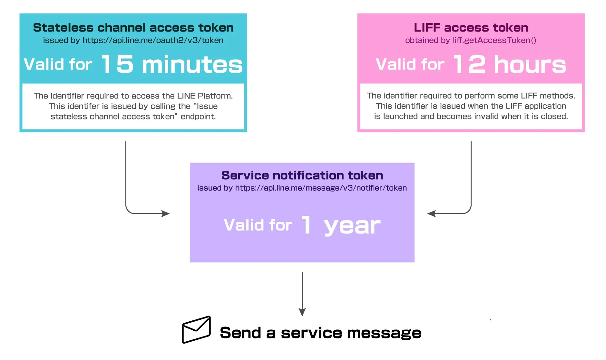
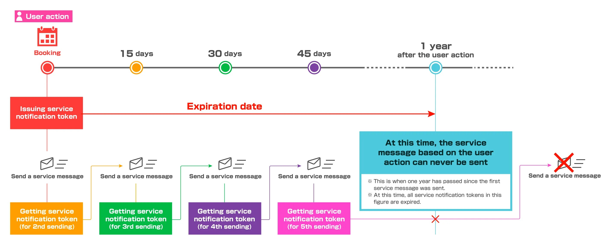
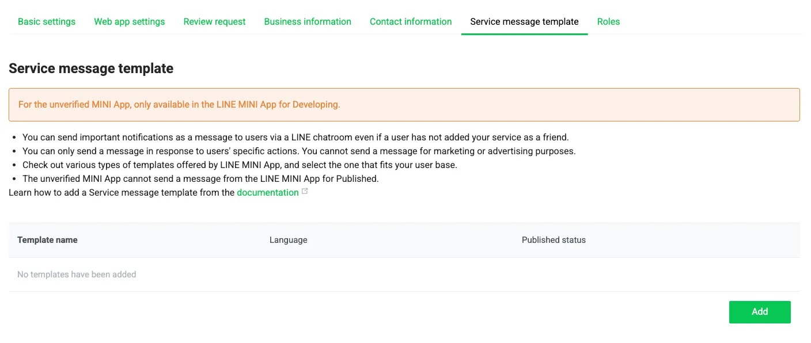
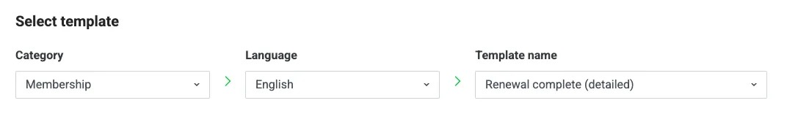
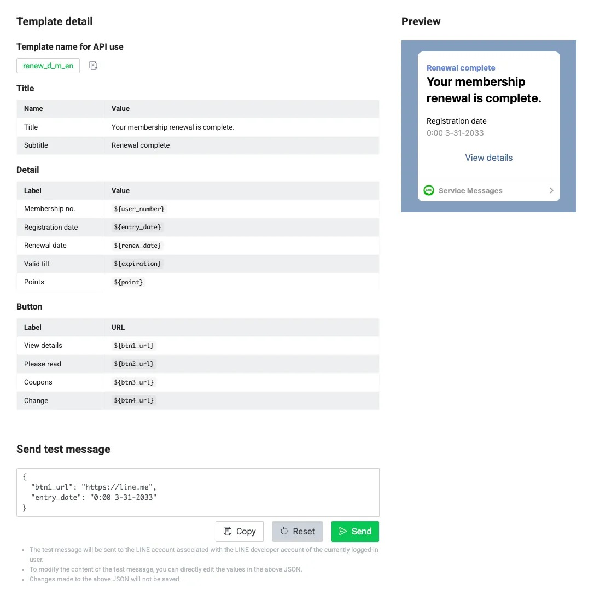
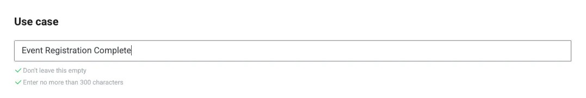
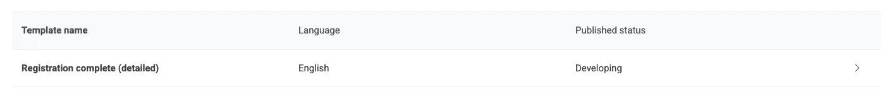

# ทดลองเล่น Service Message บนสภาพแวดล้อมสำหรับการทดสอบ

ถึงแม้ว่า Service Message จะเป็นฟีเจอร์ที่เปิดให้ Verified MINI App ใช้งานได้เท่านั้น แต่เราก็ยังสามารถทดสอบกายส่งการแจ้งเตือน Service Message ได้ในสภาพแวดล้อม Developing หากต้องการใช้ในสภาพแวดล้อม Published จะต้องยื่นเอกสารให้ทาง LINE ทำการตรวจสอบ

## Service Message คืออะไร

ข้อความแจ้งเตือน หรือ Service Message เป็นบริการพิเศษสำหรับ LINE MINI App โดยเฉพาะ ให้ผู้ให้บริการสามารถ**ส่งข้อความแจ้งเตือนผู้ใช้ หลังจากการกระทำบน LINE MINI App** เช่น การลงทะเบียน การจอง หรือการกระทำประเภทอื่นอีกหลายรูปแบบ โดยข้อความจะถูกกำหนดรูปแบบชัดเจน และส่งผ่าน LINE Official Account (LINE OA) ส่วนกลางของ LINE MINI App ชื่อว่า LINE MINI App Notice


ในการส่ง Service Message สิ่งที่จะต้องใช้คือ Channel Access Token และ LIFF Access Token เพื่อทำการออก Service Notification Token เพื่อส่งข้อความแจ้งเตือนหาผู้ใช้งาน



โดย Service Notification Token จะมีอายุ 1 ปี และสามารถส่งได้สูงสุด 5 ครั้งต่อการสร้าง Service Notification Token 1 ครั้ง



## สร้างเทมเพลต Service Message

ก่อนที่เราจะทำการส่ง Service Message ไปหาผู้ใช้ เราจำเป็นที่จะต้องสร้างเทมเพลตเสียก่อน โดยไปที่แท็บ `Service message template` และกด `Add`



ภายใต้หัวข้อ `Select template` ให้เลือกเทมเพลตที่ต้องการใช้งาน โดยมีมากถึง 12 หมวดหมู่ให้เลือก จากนั้นเลือกภาษา และเลือกเทมเพลตที่ตรงกับความต้องการ



เมื่อทำการเลือกเทมเพลตสำเร็จแล้ว ภายใต้หัวข้อ `Template detail` จะแสดงชื่อเทมเพลตที่ใช้ในการส่ง (Template name for API use) รวมถึงตัวแปรต่าง ๆ ที่สามารถเปลี่ยนแปลงได้



ด้านล่างภายใต้หัวข้อ `Send test message` จะเป็นการทดลองการส่งข้อความจริงหาตัวเอง สามารถแก้เนื้อหาภายในข้อความที่จะส่งได้ หากไม่ต้องการแถวหรือตัวแปรไหน เราก็สามารถลบตัวแปรนั้นออกไปได้ ก็จะเป็นการตัดแถว ๆ นั้นออกไป โดยเราจะดูตัวอย่างก่อนส่งได้ทางกล่องด้านบน กด `Send` เพื่อทำการทดสอบส่งให้ตัวเอง เมื่อได้ข้อความที่ต้องการแล้ว กด `Copy` เพื่อคัดลอกโครงเนื้อหาที่จะใช้งานไปเป็นตัวอย่าง Payload เพื่อนำไปใช้ในการส่งต่อไป



ก่อนกด `Add` ให้ใส่ Use case หรือวัตถุประสงค์การใช้งานของข้อความนี้ เพื่อใช้ในขั้นตอนการตรวจสอบ หากเป็นการทดสอบเฉย ๆ สามารถใส่อะไรไปก็ได้ จากนั้นกด `Add`



## สร้าง Stateless Channel Access Token

เราต้องเตรียมฟังก์ชันสำหรับการสร้าง Stateless Channel Access Token เพื่อสร้าง Service Notification Token

```typescript
export const issueStatelessAccessToken = async (): Promise<string> => {
  try {
    const channelId = process.env.LINE_MESSAGING_CHANNEL_ID!
    const cacheKey = `line:token:${channelId}`

    // Try to get token from Redis
    let token = await redisGet(cacheKey)
    if (!token) {
      const response: AxiosResponse<LineAccessTokenResponse> = await axios.post(
        process.env.LINE_MESSAGING_OAUTH_ISSUE_TOKENV3!,
        new URLSearchParams({
          grant_type: 'client_credentials',
          client_id: channelId,
          client_secret: process.env.LINE_MESSAGING_CHANNEL_SECRET!,
        }),
        {
          headers: {
            'Content-Type': 'application/x-www-form-urlencoded',
          },
        },
      )

      if (response.data?.access_token) {
        token = response.data.access_token
        await redisSet(cacheKey, token, 900)
        return token
      } else {
        throw new Error('Failed to obtain stateless access token.')
      }
    }

    return token
  } catch (error: any) {
    console.error('Error issuing token:', error.message)
    throw error
  }
}
```

## สร้าง Service Notification Token สำหรับส่ง Service Message

ในการส่ง Service Message เราจะต้องมี LIFF Access Token ที่ได้มาจากการกระทำของผู้ใช้บน LINE MINI App เสียก่อน โดยหลังจากที่ผู้ใช้ทำการกดปุ่ม หรือทำการกระทำใด ๆ บน LINE MINI App เราจะส่ง LIFF Access Token กลับไปยัง Server ของเรา พร้อมกับข้อมูลที่เราต้องการเก็บไว้ (หากมี)

```typescript
const response = await fetch('https://api.example.com/register', {
  method: 'POST',
  headers: {
    'Content-Type': 'application/json'
    'x-liff-access-token': liff.getAccessToken()
  },
  body: JSON.stringify({
    name: 'John Doe',
    age: 24,
    country: 'Thailand'
  })
})
```

จากนั้นเราจะทำการสร้าง Service Notification Token โดยใช้ LIFF Access Token ที่ได้มาพร้อมกับ Channel Access Token ที่เราสร้างไว้ในขั้นตอนก่อนหน้า

```typescript
const issueServiceNotificationToken = async (liffAccessToken: string) => {
  const channelAccessToken = await issueStatelessAccessToken()

  const response = await axios.post(
    'https://api.line.me/message/v3/notifier/token',
    { liffAccessToken },
    {
      headers: {
        'Content-Type': 'application/json',
        Authorization: `Bearer ${channelAccessToken}`,
      },
    },
  )

  return response.data
}
```

Service Notification Token ที่ได้มานั้นจะมีอายุ 1 ปี และสามารถใช้ได้สูงสุด 5 ครั้งต่อการสร้าง Service Notification Token จาก LIFF Access Token 1 ครั้ง

```json
{
  "notificationToken": "34c11a03-b726-49e3-8ce0-949387a9..",
  "expiresIn": 31536000,
  "remainingCount": 5,
  "sessionId": "xD06...."
}
```

## ส่ง Service Message หาผู้ใช้งาน

เมื่อเราได้ Service Notification Token และข้อมูล Template ที่จะส่งมาเรียบร้อยแล้ว ก็ถึงเวลาส่ง Service Message ให้ผู้ใช้งาน

```typescript
const sendServiceMessage = async (
  notificationToken: string,
  templateName: string,
  variables: Record<string, string>,
) => {
  const channelAccessToken = await issueStatelessAccessToken()

  const response = await axios.post(
    'https://api.line.me/v2/bot/message/push',
    {
      templateName,
      params: variables,
      notificationToken,
    },
    {
      headers: {
        'Content-Type': 'application/json',
        Authorization: `Bearer ${channelAccessToken}`,
      },
    },
  )

  return response.data
}
```

หลังจากส่ง Service Message หาผู้ใช้งานเรียบร้อยแล้ว ใน Response จะมี Service Notification Token อีก 1 ชุด โดยให้เราเก็บไว้ใช้งานในการส่งครั้งถัดไป (ไม่สามารถใช้ Service Notification Token เดิมส่งได้)

```json
{
  "notificationToken": "c9884874-bf6a-4241-8999-2767241c...",
  "expiresIn": 31535906,
  "remainingCount": 3,
  "sessionId": "xD06...."
}
```

หากส่งครบ 5 ครั้งแล้ว จะไม่สามารถส่ง Service Message ได้อีก โดยจะต้องทำการสร้าง Service Notification Token ใหม่จาก LIFF Access Token ใหม่อีกครั้ง

```json
{
  "expiresIn": 0,
  "remaningCount": 0
}
```

## Demo

### LIFF

```typescript
<template>
  <div class="profile-card" v-if="profile">
    <div class="profile-header">
      
      <h2 class="profile-name">{{ profile.displayName }}</h2>
    </div>
    <div class="profile-body">
      <div class="profile-item">
        <span class="label">Status Message:</span>
        <span>{{ profile.statusMessage || 'No status message' }}</span>
      </div>
      <div class="profile-item">
        <span class="label">Email:</span>
        <span>{{ email || 'No email available' }}</span>
      </div>
      <div class="profile-item">
        <span class="label">User ID:</span>
        <span>{{ profile.userId }}</span>
      </div>
      <div class="profile-item">
        <span class="label">Friend Ship:</span>
        <span>{{ friendShip }}</span>
      </div>
      <div class="profile-item">
        <span class="label">Operating System:</span>
        <span>{{ os }}</span>
      </div>
      <div class="profile-item">
        <span class="label">App Language:</span>
        <span>{{ appLanguage }}</span>
      </div>
      <div class="profile-item">
        <span class="label">LIFF Language:</span>
        <span>{{ liffLanguage }}</span>
      </div>
      <div class="profile-item">
        <span class="label">LIFF SDK Version:</span>
        <span>{{ liffVersion }}</span>
      </div>
      <div class="profile-item">
        <span class="label">LINE App Version:</span>
        <span>{{ lineVersion }}</span>
      </div>
      <div class="profile-item">
        <span class="label">Is in LINE Client:</span>
        <span>{{ isInClient }}</span>
      </div>
      <div class="profile-item">
        <span class="label">Is MINI App:</span>
        <span>{{ isMiniApp }}</span>
      </div>
      <div class="profile-item">
        <span class="label">Can add to homescreen:</span>
        <span>{{ canAddToHomeScreen }}</span>
      </div>
    </div>

    <!-- ปุ่มสำหรับการส่งข้อความและเปิด browser-->
    <div class="button-group">
      <button v-if="isSendMessageAvailable" @click="sendMessage" class="btn">Send Message</button>
      <button @click="openWindowModule" class="btn">Open Window</button>
    </div>
    <!-- ปุ่มสำหรับการแชร์และ แสกน qrcode-->
    <div class="button-group">
      <button v-if="isShareTargetPickerAvailable" @click="shareMessage" class="btn">
        Share via LINE
      </button>
      <button v-if="isQrCodeAvailable" @click="openQRCodeModule" class="btn">Scan QR</button>
    </div>

    <!-- ปุ่มสำหรับการลงทะเบียนและแจ้งเตือนใน LINE MINI App-->
    <div class="button-group">
      <button v-if="isMiniApp" @click="miniAppRegister" class="btn">Register</button>
      <button v-if="isMiniApp" @click="miniAppNotify" class="btn">Notify</button>
    </div>
  </div>
</template>

<script>
import liff from '@line/liff'
export default {
  beforeCreate() {
    liff
      .init({
        liffId: import.meta.env.VITE_LIFF_ID,
      })
      .then(() => {
        this.message = 'LIFF init succeeded.'
      })
      .catch((e) => {
        this.message = 'LIFF init failed.'
        this.error = `${e}`
      })
  },
  data() {
    return {
      profile: null,
      friendShip: null,
      email: null,
      os: null,
      appLanguage: null,
      liffLanguage: null,
      liffVersion: null,
      lineVersion: null,
      isInClient: null,
      isShareTargetPickerAvailable: null,
      isSendMessageAvailable: false,
      isQrCodeAvailable: false,
      message: '',
      error: '',
      isMiniApp: false,
      canAddToHomeScreen: false,
    }
  },
  async mounted() {
    await this.checkLiffLogin()
  },
  methods: {
    async checkLiffLogin() {
      await liff.ready.then(async () => {
        if (!liff.isLoggedIn()) {
          liff.login({ redirectUri: window.location })
        } else {
          const profile = await liff.getProfile()
          this.profile = profile
          const friendShip = await liff.getFriendship()
          this.friendShip = friendShip.friendFlag
          // ดึงข้อมูลอีเมล
          const decodedIdToken = liff.getDecodedIDToken()
          console.log(decodedIdToken)
          this.email = decodedIdToken.email

          const idToken = liff.getIDToken()
          console.log(idToken)

          // ดึงข้อมูลต่าง ๆ ของ LIFF
          this.os = liff.getOS()
          this.appLanguage = liff.getAppLanguage()
          this.liffLanguage = liff.getLanguage()
          this.liffVersion = liff.getVersion()
          this.lineVersion = liff.getLineVersion()
          this.isInClient = liff.isInClient()

          this.isQrCodeAvailable = liff.isApiAvailable('scanCodeV2') // ตรวจสอบว่า API scanCodeV2 ใช้งานได้หรือไม่
          this.isShareTargetPickerAvailable = liff.isApiAvailable('shareTargetPicker') // ตรวจสอบว่า API shareTargetPicker ใช้งานได้หรือไม่

          const context = liff.getContext()

          // ตรวจสอบว่ามี scope ที่สามารถส่งข้อความได้หรือไม่ (chat_message.write)
          if (context.scope.includes('chat_message.write')) {
            this.isSendMessageAvailable = true
          }

          // ตรวจสอบว่าเป็น LINE MINI App หรือไม่
          this.isMiniApp = !!context.miniDomainAllowed

          // ตรวจสอบว่าสามารถเพิ่มไปยังหน้าจอหลักได้หรือไม่
          this.canAddToHomeScreen = liff.isApiAvailable('createShortcutOnHomeScreen')
        }
      })
    },

    //
    async openWindowModule() {
      liff.openWindow({
        url: 'https://line.me',
        external: true,
      })
    },

    async openQRCodeModule() {
      if (this.isInClient) {
        await liff
          .scanCodeV2()
          .then((result) => {
            alert(JSON.stringify(result))
          })
          .catch((error) => {
            console.log('error', error)
          })
      }
    },

    // ฟังก์ชันสำหรับส่งข้อความ
    async sendMessage() {
      if (this.isInClient) {
        try {
          await liff
            .sendMessages([
              {
                type: 'text',
                text: 'This is a message from LIFF!',
              },
            ])
            .then(alert('Message sent!'))
            .catch(function (res) {
              console.log('Failed to launch ShareTargetPicker')
            })
          liff.closeWindow()
        } catch (error) {
          console.error('Error sending message:', error)
          alert('Failed to send message.')
        }
      }
    },

    // ฟังก์ชันสำหรับแชร์ข้อความผ่าน LINE
    async shareMessage() {
      try {
        if (liff.isApiAvailable('shareTargetPicker')) {
          const options = {
            isMultiple: true, // เปลี่ยนเป็น false ถ้าต้องการให้เลือกผู้รับได้แค่หนึ่งคน
          }
          liff
            .shareTargetPicker(
              [
                {
                  type: 'text',
                  text: 'Check this out!',
                },
                {
                  type: 'flex',
                  altText: 'Flex Message',
                  contents: {
                    type: 'bubble',
                    hero: {
                      type: 'image',
                      url: this.profile.pictureUrl,
                      size: 'full',
                      aspectRatio: '1:1',
                      aspectMode: 'cover',
                    },
                    body: {
                      type: 'box',
                      layout: 'vertical',
                      contents: [
                        {
                          type: 'text',
                          text: this.profile.displayName,
                          weight: 'bold',
                          size: 'xl',
                          align: 'center',
                          margin: 'md',
                        },
                        {
                          type: 'box',
                          layout: 'vertical',
                          margin: 'lg',
                          spacing: 'sm',
                          contents: [
                            {
                              type: 'box',
                              layout: 'baseline',
                              spacing: 'sm',
                              contents: [
                                {
                                  type: 'text',
                                  text: 'User ID:',
                                  color: '#aaaaaa',
                                  size: 'sm',
                                  flex: 2,
                                },
                                {
                                  type: 'text',
                                  text: this.profile.userId,
                                  wrap: true,
                                  color: '#666666',
                                  size: 'sm',
                                  flex: 4,
                                },
                              ],
                            },
                          ],
                        },
                      ],
                    },
                  },
                },
              ],
              options,
            )
            .then(console.log('ShareTargetPicker was launched'))
            .catch(function (res) {
              console.log('Failed to launch ShareTargetPicker')
            })
        }
      } catch (error) {
        console.error('Error sharing message:', error)
        alert('Failed to share message.')
      }
    },

    async miniAppRegister() {
      if (this.isMiniApp) {
        try {
          const result = await fetch(`${import.meta.env.VITE_API_URL}/miniapp/register`, {
            method: 'POST',
            headers: {
              'Content-Type': 'application/json',
              'x-liff-access-token': liff.getAccessToken(),
            },
            body: JSON.stringify({
              userId: this.profile.userId,
              email: this.email,
              displayName: this.profile.displayName,
              pictureUrl: this.profile.pictureUrl,
              // ข้อมูลอื่น ๆ ที่ต้องการบันทึก
            }),
          })
        } catch (error) {
          console.error('Error registering to LINE MINI App:', error)
          alert('Failed to register to LINE MINI App.')
        }
      }
    },

    async miniAppNotify() {
      if (this.isMiniApp) {
        try {
          const result = await fetch(`${import.meta.env.VITE_API_URL}/miniapp/notify`, {
            method: 'POST',
            headers: {
              'Content-Type': 'application/json',
              'x-liff-access-token': liff.getAccessToken(),
            },
          })
        } catch (error) {
          console.error('Error notifying to LINE MINI App:', error)
          alert('Failed to notify to LINE MINI App.')
        }
      }
    },
  },
}
</script>

<style scoped>
#app {
  font-family: Avenir, Helvetica, Arial, sans-serif;
  -webkit-font-smoothing: antialiased;
  -moz-osx-font-smoothing: grayscale;
  text-align: center;
  color: #2c3e50;
  margin-top: 60px;
}

.profile-card {
  max-width: 400px;
  margin: 20px auto;
  background-color: #ffffff;
  border-radius: 10px;
  box-shadow: 0 4px 8px rgba(0, 0, 0, 0.1);
  overflow: hidden;
  font-family: 'Arial', sans-serif;
}

.profile-header {
  display: flex;
  align-items: center;
  padding: 20px;
  background-color: #f7f7f7;
  border-bottom: 1px solid #ddd;
}

.profile-pic {
  border-radius: 50%;
  width: 80px;
  height: 80px;
  margin-right: 20px;
}

.profile-name {
  font-size: 24px;
  margin: 0;
}

.profile-body {
  padding: 20px;
}

.profile-item {
  display: flex;
  justify-content: space-between;
  padding: 10px 0;
  border-bottom: 1px solid #eee;
}

.profile-item:last-child {
  border-bottom: none;
}

.label {
  font-weight: bold;
  color: #555;
}

@media (max-width: 600px) {
  .profile-card {
    padding: 10px;
  }

  .profile-header {
    flex-direction: column;
    align-items: center;
    text-align: center;
  }

  .profile-pic {
    margin: 0 0 10px 0;
  }

  .profile-name {
    font-size: 20px;
  }
}

.button-group {
  margin-top: 20px;
  display: flex;
  justify-content: space-between;
}

.btn {
  padding: 10px 20px;
  background-color: #00c300;
  color: white;
  border: none;
  border-radius: 5px;
  cursor: pointer;
}

.btn-full {
  width: 100%;
}

.btn:hover {
  background-color: #009e00;
}
</style>

```

### API

```typescript
import {
  generateServiceNotificationToken,
  getProfileByLiffAccessToken,
  sendServiceMessage,
} from '@/utils/line'
import { getNotificationTokenByUserId, saveNotificationTokenToDatabase } from '@/utils/mongo'
import express from 'express'

const router = express.Router()

router.post('/register', async (req, res) => {
  const { headers } = req

  const liffAccessToken = headers['x-liff-access-token']
  if (!liffAccessToken) {
    return res.status(401).json({ message: 'Unauthorized' })
  }

  const profile = await getProfileByLiffAccessToken(liffAccessToken)
  if (!profile) {
    return res.status(401).json({ message: 'Unauthorized' })
  }

  const { notificationToken } = await generateServiceNotificationToken(liffAccessToken)

  const serviceMessageResult = await sendServiceMessage(notificationToken, 'join_d_m_th', {
    point: '100 พอยท์',
    btn1_url: 'https://line.me',
    btn2_url: 'https://line.me',
    btn3_url: 'https://line.me',
    btn4_url: 'https://line.me',
    entry_date: '31/03/2033 0:00 น. ',
    expiration: '10/10/2044 0:00 น. ',
    user_number: '11023',
  })

  await saveNotificationTokenToDatabase(profile.userId, serviceMessageResult)

  return res.json({ message: 'Register Successfully' })
})

router.post('/notify', async (req, res) => {
  const { headers } = req
  const liffAccessToken = headers['x-liff-access-token']
  if (!liffAccessToken) {
    return res.status(401).json({ message: 'Unauthorized' })
  }
  const profile = await getProfileByLiffAccessToken(liffAccessToken)
  if (!profile) {
    return res.status(401).json({ message: 'Unauthorized' })
  }

  const { notificationToken } = await getNotificationTokenByUserId(profile.userId)

  const serviceMessageResult = await sendServiceMessage(notificationToken, 'join_d_m_th', {
    point: '100 พอยท์',
    btn1_url: 'https://line.me',
    btn2_url: 'https://line.me',
    btn3_url: 'https://line.me',
    btn4_url: 'https://line.me',
    entry_date: '31/03/2033 0:00 น. ',
    expiration: '10/10/2044 0:00 น. ',
    user_number: '11023',
  })

  await saveNotificationTokenToDatabase(profile.userId, serviceMessageResult)

  return res.json({ message: 'Notify Successfully' })
})

export default router
```
